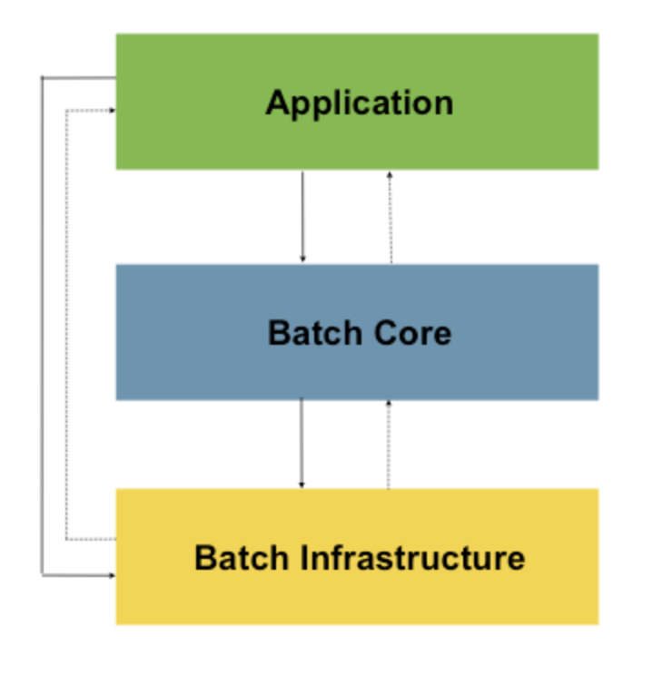

# Spring Batch Introduction

스프링 배치 특징

- 경량 배치 프레임워크.
- Spring Frameword의 특징(생산성, POJO, 사용 편의성 등)을 기반으로 만들어졌다.
- 스케쥴링 프레임워크가 아니기 때문에 스케쥴러를 대처하는 개념이 아니라 스케쥴러와 함께 동작하도록 설계되었다.
- 로깅/추적, 트랙잭션 관리, 리소스 관리 등 대용량 데이터 처리에 필수적인 기능을 재사용할 수 있게 설계 되었다.
- 배치 작업을 손쉽게 확장할 수 있고, 많은 데이터를 처리할 수 있다.

# 1. Background

- 자바 기반의 배치 처리에서 재사용 가능한 프레임워크가 존재하지 않았다.
- SpringSource(현재의 Pivotal)과 Accenture이 함께 만들었다.

# 2. Usage Scenarios

일반적인 배치 프로그램 프로세스

1. 데이터 베이스, 파일, 큐에서 다량의 데이터를 조회한다.
2. 특정 방법으로 데이터를 가공한다.
3. 데이터를 수정된 양식으로 다시 저장한다.

스프링 배치

- 유사한 트랜잭션을 하나로 묶어 처리한다.
- 이러한 트랜잭션의 반복적인 작업을 자동화한다.
- 스프링 배치는 엔터프라이즈 스케일 솔루션을 제공하는 유일한 오픈 소스 프레임워크이다.

## 비즈니스 시나리오(Business Scenarios)

- 배치 프로세스를 주기적으로 커밋.
- 동시 다발적인 배치 처리 : job을 병렬 처리
- 단계적인 엔터프라이즈 메시지 중심 처리
- 다량의 병렬 배치 처리
- 실패 후 수동 또는 스케쥴링에 의한 재시작
- 의존관계가 있는 step 여러 개를 순차적으로 처리(워크플로우 중심 배치로 확장)
- 부분 처리 : 레코드 스킵(e.g 롤백 시)
- 배치 규모가 작거나, 저장 프로시저(store procedure)나 스크립트가 이미 있는 경우 배치 전체에 걸친 트랜잭션

## 기술 목표(Technical Objectives)

- 배치 개발자는 스프링 프로그래밍 모델을 사용한다.
  - 개발자는 비즈니스 로직에 집중한다.
  - 기반 구조는 프레임워크가 관리한다.
- 기반 구조, 배치 실행 환경, 배치 어플리케이션의 관심사는 명확하게 분리한다.
- 공통 핵심 서비스는 모든 프로젝트에서 구현할 수 있게 인터페이스로 제공한다.
- 핵심 인터페이스는 ‘바로 사용할 수 있는’ 간단한 디폴트 구현체를 제공한다.
- 모든 계층의 스프링 프레임워크를 활용해 서비스를 쉽게 설정하고 커스터마이징, 확장할 수 있다.
- 제공하는 모든 핵심 서비스는 변경, 확장이 쉽고 인프라 레벨에 영향을 주지 않아야 한다.
- 메이븐으로 빌드된 아키텍처 jar로 애플리케이션과는 완전히 분리된 간단한 배포 모델을 제공한다.

# 3. Spring Batch Architecture

- 스프링 배치는 확장성과 다양한 사용자 유형을 고려해 설계했다.

  

- Application
  - 스프링 배치를 사용하는 개발자가 만드는 모든 배치 job과 커스텀 코드를 포함한다.
- Batch Core
  - job을 실행하고 제어하는 데 필요한 핵심 런타임 클래스를 포함한다.
  - JobLauncher, Job, Step 구현체도 포함된다.
- Infrastructure
  - Application, Core 모두 Infrastructure 위에서 빌드한다.
  - 공통 reader와 writer, 서비스(RetryTemplate 등)을 포함한다.
  - 어플리케이션 개발자도 사용하고(ItemReader, ItemWriter 등), 코어 프레임워크 자체에서도 활용한다.(retry 등)

# 4. General Batch Pipelines and Guidlines

- 가능하면 공통 구성 요소를 활용하고, 아키텍처와 환경을 모두 고려해 설계해야 한다.
  - 배치 아키텍처는 일반적으로 온라인 아키텍쳐에 영향을 준다. 반대도 마찬가지다.
- 단일 배치 어플리케이션은 가능한 단순화하고 복잡한 로직은 피하라.
- 데이터 처리와 저장은 물리적으로 가까운 곳에서 수행하라.(데이터가 처리되는 곳에 데이터를 저장하라.)
- 시스템 리소스 사용(특히 I/O 등)을 최소화하라.(내부 메모리에서 가능한 많은 연산을 실행하라)
- 어플리케이션 I/O 에서 불필요한 물리적 I/O를 줄여라
  - 주의해야 할 4가지 결함
  1. 한 번 읽고 나서 캐시하거나 작업 스토리지에 저장해도 되는 데이터를 트랜잭션마다 읽는 경우
  2. 같은 트랜잭션 내에서 이미 읽은 데이터를 다시 읽는 경우
  3. 불필요한 테이블 스캔이나 인덱스 스캔을 유발하는 경우
  4. SQL 구문에서 WHERE 절에 키를 지정하지 않는 경우
- 배치 실행에서 같은 작업을 두 번 하지 마라
- 실행 중에 재할당에 시간을 쏟지 않게 배치 어프리케이션 시작 시 충분한 메모리를 할당하라.
- 데이터 무결성은 최악의 상황도 고려해야 한다.
  - 데이터 무결성을 유지하고 싶으면 적절한 유효성 검증 로직을 추가해라.
- 가능한 곳에 내부 검증을 위한 체크섬을 구현하라.
- 실제 프로덕션 환경과 그에 맞는 데이터 볼륨을 가지고 가능한 빨리 부하 테스트를 계획하고 실행하라
- 데이터 베이스 백업만큼 파일 백업도 중요하다.
  - 배치 규모가 크면, 특히 그 시스템이 온라인과 동시에 무중단으로 실행된다면 백업이 매우 어려워질 수 있다.
  - 온라인 설계에서 진행하는 데이터베이스 백업만큼 파일 백업도 중요하다.
  - 시스템이 플랫(flat) 파일을 사용한다면 파일 백업 절차를 수립, 문서화하고 정기적으로 테스트해야한다.

# 5. Batch Processing Strategies

## 배치 job 설계하기 위한 비즈니스 로직 표준 구성 요소

- Conversion Applications
  - 외부 시스템에서 제공하는 여러 유형의 파일을 트랜잭션 레코드를 처리할 때 필요한 표준 포맷으로 변환하기 위해 필요
  - 이런 유형의 배치 어플리케이션은 translation 유틸리티 모듈을 부분적으로 혹은 전체를 포함한다(Basic Batch Service 확인)
- Validation Applications
  - 입출력 레코드가 정확하고 일관성 있는지 검사한다.
  - 일반적으로 파일 헤더와 트레일러, 체크섬, 검증 알고리즘, 레코드 교차 점검을 기반으로 만든다.
- Extract Applications
  - 데이터베이스나 입력 파일로부터 미리 정의된 규칙대로 데이터를 읽어 결과 파일에 저장한다.
- Extract/Update Applications
  - 데이터베이스나 입력 파일로부터 레코드셋을 읽고 각 데이터 유형에 따라 변경사항을 적용하고 저장하는 어플리케이션
- Processing and Updating Applications
  - extract application이나 validation application에서 받은 입력 트랜잭션에 대한 처리를 수행하는 어플리케이션.
  - 보통 데이터베이스를 읽어 처리에 필요한 데이터를 얻고, 필요하면 데이터베이스를 수정하고, 출력 처리를 위한 레코드를 만드는 일을 포함한다.
- Output/Format Application
  - 입력 파일을 읽어서 표준 포맷으로 재구성한다.
  - 다른 프로그램이나 시스템에 전송하는 어플리케이션
- 위 구성 요소로만 만들 수 없는 비즈니스 로직을 위한 어플리케이션 쉘 제공

## 표준 유틸리티 Step

- Sort
  - 입력 파일을 읽고 지정한 필드로 재정렬한 결과 파일을 제공하는 프로그램
  - 보통 표쥰 시스템 유틸리티로 구현한다.
- Split
  - 입력 파일을 하나 읽어서 각 레코드를 필드 값에 따라 여러 파일로 나눠서 저장하는 프로그램
  - 매개변수 기반 표준 시스템 유틸리티에 의해 조정되거나 수행될 수 있다.
- Merge
  - 여러 입력 파일을 읽어서 데이터를 결합해 하나의 결과 파일을 제공하는 프로그램
  - 매개변수 기반 표준 시스템 유틸리티에 의해 조정되거나 수행될 수 있다.

## 입력 소스별 분류

- 데이터베이스 지향(Database-driven)
  - 데이터베이스로부터 읽은 row나 값에 의해 구동한다.
- 파일 지향(File-Driven)
  - 파일로부터 읽어온 레코드나 값에 의해 구동된다.
- 메세지 지향(Message-Driven)
  - 메세지 큐로부터 읽어온 메세지에 의해 구동된다.

## 배치를 위한 일반적인 처리 옵션(구현 복잡도 낮은 순)

1. 오프라인 모드에서 하나의 배치에서 실행되는 일반적인 처리
2. 동시에 실행되는 배치나 온라인 처리
3. 여러 배치나 job을 동시에 병렬 처리
4. 파티셔닝(동시에 같은 job을 여러 인스턴스로 처리)
5. 1~4 옵션을 조합하는 경우

⇒ 상용 스케쥴러는 위 옵션 중 일부나 전체를 지원한다.
