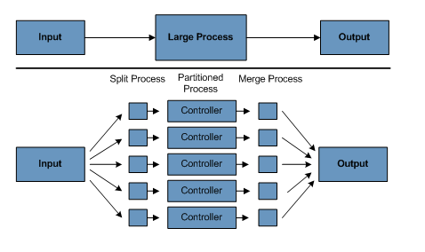

# Spring Batch Introduction

## 잠금(Lock) 전략

- 데이터베이스 lock을 추적하고, DB 작업을 요청하는 어플리케이션에 권한을 부여하거나 거부하는 서비스
- 잠금 상태에서 배치 job이 중단되는 것을 막기 위한 아키텍처 재시도 로직을 구현할 수 있다.

1. Normal Processing in a batch windo
   - 분리된 배치 환경(온라인 사용자나 다른 배치 프로세스)의 간단한 배치 프로세스
   - 이 프로세스에서는 동시성 문제가 발생하기 않는다.
   - 배치 실행이 끝나면 단일 커밋을 수행하면 된다.
   - ⇒ 단일 커밋에만 의존하고 있다면 나중에 수정하기 어렵다.
2. Concurrent batch or on-line processing

   - 온라인 사용자가 동시에 수정할 수 있는 데이터를 처리하는 배치에서는 데이터 lock이 걸리면 안된다.
   - 하지만, 트랜잭션이 몇 번 끝나면 수정 내역을 DB에 커밋해야 한다.
   - 이 과정을 통해 다른 프로세스에서 사용할 수 없는 데이터 양도 최소화하고, DB를 사용하지 못하는 시간도 최소화할 수 있다.
   - 물리적 잠금을 최소화하는 또 다른 방법은 row 레벨 잠금을 구현하는 것이다.
     1. Optimistic Locking Pattern(낙관적 잠금 패턴)
        - 낙관적 잠금은 레코드 경합 가능성이 낮다는 가정에서 시작한다.
        - 동시에 사용하는 DB 테이블에 timestamp 컬럼을 추가해서 구현한다.
        - 어플리케이션이 데이터 처리를 위해 row를 읽어오면, timestamp도 함께 따라온다.
        - 데이터 수정 시 timestamp를 비교하여 같은 경우 UPDATE를 진행하고, 그렇지 않으면 수행하지 않는다.
        - timestamp가 다르다는 것은 읽고 수정하는 사이에 다른 어플리케이션에서 row를 수정했다는 것을 말한다.
     2. Pessimistic Locking Pattern(비관적 잠금 패턴)
        - 비관적 잠금은 레코드 경합이 발생할 가능성이 높다는 가정에서 시작한다.
        - 데이터에 접근하는 동안 물리적 잠금이나 논리적 잠금이 필요하다고 여기는 모든 잠금 전략을 뜻한다.
        - 테이블에 lock 컬럼을 지정해 쓰는 경우도 있다.
        - 데이터 수정을 위해 row를 요청하면, lock 컬럼에 플래그를 설정한다.
        - 다른 어플리케이션이 데이터 수정 요청 시 lock컬럼에 플래그가 설정되어 있다면, 수정에 실패한다.
        - 플래그를 설정한 어플리케이션이 row를 수정하면 플래스를 없앤다.
        - 처음 데이터를 읽고 플래그를 설정하는 동안에도 데이터 무결성을 유지해야 한다는 점을 주의해야 한다.

3. Parallel Processing

   - 여러 배치를 실행하거나 job을 병렬로 실행하면 총 배치 소요 시간을 줄일 수 있다.
   - 여러 job이 같은 파일, db 테이블, 인덱스 공간을 공유하지 않는다면 문제가 되지 않는다.
     - 이 경우에는 파티션된 데이터를 이용해 구현한다.
   - 다른 방법으로는 컨트롤 테이블을 사용해 상호 의존성을 관리하는 아키텍처 모델을 구축하는 것이다.
     - 컨트롤 테이블은 각 공유 자원으로 쓰일 row 정보와 어플리케이션에서 사용 중인지 여부를 저장해야 한다.
     - 이 테이블로부터 정보를 읽어와 필요한 리소스에 접근할 수 있는지 판단한다.
   - 데이터 접근이 정상적으로 된다면, 여러 쓰레드를 이용하여 병렬로 처리하면 된다.
   - 병렬 처리에서 로드 밸런싱과 파일, 데이터베이스 버퍼 풀 등의 공용 시스템 자원 가용성 등의 문제가 발생할 수 있다.

4. Partitioning

   - 파티셔닝을 이용하면 각기 다른 규모의 배치 어플리케이션을 동시에 실행할 수 있다.
   - 또한, 긴 배치 job을 실행하는 데 필요한 시간을 줄이는 것을 목표로 한다.
   - 파일이나 DB 테이블을 분할하여 각 어플리케이션을 각기 다른 데이터 셋과 함께 실행할 수 있다면 파티셔닝을 이용할 수 있다.
   - 파티션된 작업은 지정된 데이터 셋만 처리하도록 설계해야 한다.

     

   - 아키텍처는 파티션 수를 동적으로 설정할 수 있어야 하며 자동 설정, 수동 설정 모두 고려해야 한다.

   1. Partitioning Approaches
      - Fixed and Even Break-Up of Record Set
        - 입력 레코드 셋을 균등하게 나눈다.
        - 나눠진 레코드 셋을 batch/extract application의 각 인스턴스가 처리한다.
        - 데이터 셋을 나누기 위한 사전 작업이 필요하다.
        - 사전 작업 과정에서 레코드 셋의 경계를 계산하기 때문에 오버헤드가 발생할 수 있다.
      - Break up by a Key Column
        - location code 같은 키 컬럼으로 레코드 셋을 나눠서 데이터를 각 값에 따라 배치 인스턴스에 할당하는 방법.
        1. 파티셔닝 테이블로 배치 인스턴스 할당
           - 새 값이 추가되면 batch/extract application에 수동으로 설정해줘야 추가된 값도 특정 인스턴스에 할당된다.
        2. 값을 나눠서 배치 인스턴스 할당(0000-9999, 1000-1999 등)
           - 모든 값이 배치 job 인스턴스에 반영됨을 보장한다.
           - 하나의 인스턴스에서 처리되는 값의 개수는 해당 값들의 분포에 따라 다르다.
           - 그렇기 때문에 데이터 범위는 파티셔닝을 고려해 설계해야 한다.
        - 위 2가지 방법 모두 레코드를 각 배치 인스턴스에 완전히 동일하게 분배할 수는 없다.
        - 배치 인스턴스가 사용할 레코드 수를 변경해주는 동적인 설정은 없다.
      - Breakup by View
        - 데이터 베이스 레벨에서 키 컬럼으로 분할한다.
        - 레코드 셋을 뷰로 쪼개고, 각 배치 어플리케이션 인스턴스는 이 뷰를 조회한다.
        - 여기서 데이터를 그룹화 하여 분할한다.
        - 각 배치 어플리케이션 인스턴스는 특정 뷰를 참조하도록 설정해야한다.
        - 새 데이터 추가 시 새 그룹을 뷰에 추가해야 한다.
        - 인스턴스 수를 변경하면 뷰도 바뀌기 떄문에 동적인 설정은 불가능하다.
      - Addition of a Processing Indicator
        - 식별자 역할을 하는 새 컬럼을 입력 테이블에 추가하는 방법.
        - 전 처리 단계에서 모든 식별자는 처리되지 않음으로 마킹된다.
        - 배치 과정에서 처리되지 않은 데이터만 읽으며, 한 번 읽으면 잠금과 함께 처리중으로 다시 마킹된다.
        - 처리 완료 시 완료나 에러로 업데이트 한다.
        - 별도의 컬럼을 이용하여 레코드가 한 번만 처리되는 것을 보장하기 때문에 아무 변경 없이 여러 배치 어플리케이션을 시작할 수 있다.
        - 테이블의 I/O 가 증가한다는 단점이 있지만, 업데이트를 수행하는 배치 어플리케이션은 항상 write가 있기 떄문에 단점을 피할 수 있다.
      - Extract Table to a Flat File
        - 테이블을 추출하여 파일로 만드는 방법.
        - 파일로 만든 후 여러 조각(segment)으로 분할하여 배치 인스턴스의 입력으로 사용한다.
        - 테이블 추출과 분할하는 오버헤드가 발생하여, 멀티 파티셔닝의 이점이 상쇄될 수 있다.
        - 파일을 나누는 스크립트를 수정하는 방식을 통해 동적인 설정이 가능하다.
      - Use of a Hashing Column
        - 드라이버 레코드 검색 시 쓰는 DB 테이블에 해시 컬럼(key/index)을 추가한다.
        - 이 컬럼은 특정 row를 어떤 배치 어플리케이션 인스턴스가 처리하는 결정한다.
        - 레코드를 조회할 때 사용하는 프로시저는 특정 식별자로 마킹된 모든 row를 조회하기 위한 WHERE 절을 따로 추가한다.
        - 간단한 배치 어플리케이션을 활용해 식별자를 수정하여 인스턴스 부하를 재분배할 수 있다.
        - 새로 추가된 row가 충분히 많다면, 새 데이터를 다른 인스턴스에 재분배하기 위해 배치를 실행할 수 있따.

5. Database and Application Design Principles

   - 키 컬럼 접근법으로 분할된 데이터 베이스를 사용하기 위해서는 파티션 파라미터를 저장하기 위한 중앙 파티션 레포지토리가 필요하다.
   - 이를 통해 유연성을 제공할 수 있으며, 유지보수 또한 보장된다.
   - 이 레포지토리는 일반적으로 파티션 테이블로 알려진 테이블 한 개를 저장한다.
   - 파티션 테이블에 저장된 정보는 정적이며 DBA가 관리한다.
   - 파티션 테이블의 row에는 하나의 파티션 정보를 담고 있다.
   - 프로그램 ID Code, 파티션 넘버(파티션의 논리ID), 파티션을 위한 db key 컬럼의 하한값, 상한값을 저장할 컬럼이 필요하다.
   - 프로그램 시작 시 아키텍처에 있는 프로그램 ID와 파티션 넘버를 어플리케이션에 넘겨줘야 한다.
   - 키 컬럼 접근법 사용시 어플리케이션이 처리할 데이터 범위를 결정하기 위해 이 변수들로 파티션 테이블을 조회한다.

6. Minimizing Deadlocks

   - 어플리케이션 병렬 실행이나 파티셔닝 사용 시 교착상태에 빠질 수 있다.
   - 데이터베이스 설계 시 경합이 자주 발생할 수 있는 상황을 가능한 줄여야 한다.
   - 개발자는 데이터 베이스 인덱스 테이블이 교착상태와 성능을 모두 고려해 설계되었는지 확인해야 한다.
   - 교착상태는 로그 테이블이나 관리 테이블, 잠금 테이블 등의 어드민성 테이블이나 아키텍처 관련 테이블에서 발생하는 경우가 많다.
   - 아키텍처는 데이터베이스를 연결하거나 교착상태가 발생했을 때 wait-and-retry 간격을 조정하는 등의 서비스를 제공해야 한다.

7. Parameter Passing and Validation
   - 파티션 아키텍처는 어플리케이션 개발자에게 비교적 투명하게 제공돼야 한다.
   - 아키텍처는 파티셔닝 모드에서 실행하는 어플리케이션과 연관있는 모든 작업을 지원해야 한다.
     - 어플리케이션 시작 전 파티션 파라미터 검색
     - 어플리케이션 시작 전 파티션 파라미터 검증
     - 어플리케이션 시작 시 파라미터 전달
   - 검증 내용
     - 파티션 수가 전체 데이터를 처리하기에 충분한지
     - 파티션 사이 간극이 없는지.
   - 데이터베이스를 분할한다면 파티션 하나가 데이터베이스의 여러 파티션에 걸쳐있는지 별도로 검증해야 한다.
   - 아키텍처는 파티션 통합도 고려해야 한다.
     - 다음 단계로 넘어가기 전에 모든 파티션을 완료해야 하는가?
     - 파티션 중 하나가 중단되면 어떻게 처리해야 하는가?
