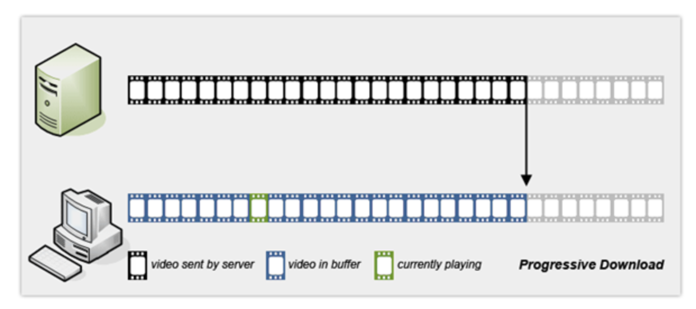

# 스트리밍

# 스트리밍

[https://www.youtube.com/watch?v=6t6Si0BWCOo](https://www.youtube.com/watch?v=6t6Si0BWCOo)

[https://d2.naver.com/helloworld/7122](https://d2.naver.com/helloworld/7122)

[https://m.blog.naver.com/suin2_91/221155034091](https://m.blog.naver.com/suin2_91/221155034091)

## 동영상 재생 방식

### 프로그레시브 다운로드(Progressive Download)

- 가장 널리 사용되는 비디오 전송 방법
  
- 구현하기가 쉽다.
- 웹 서버에 비밀번호를 올려 놓고 플레이어에게 URL을 알려주면, 플레이어가 그 파일을 다운로드 받는다.
- 어느정도 다운로드 받으면, 플레이어는 재생을 시작한다.
- 중간에 사용자가 시청을 그만 두면, 남은 시간 만큼 소모된다는 점에서 비효율적일 수 있다.
- 중간에 비디오 품질을 바꿀 수 없다.
- 라이브 스트리밍이 불가능하다.

### RTSP/RTMP 스트리밍(RTSP/RTP Streaming)

- 사용자가 현재 시청하고 있는 비디오 프레임만을 전송해주는 방식
  
- 미리 다운로드 하지 않고, 사용자가 이미 시청한 데이터는 버린다.
- 서버 측에서 많이 지원하고 있지 않다.
- 중간에 비디오 품질을 변경할 수 있다.
- 라이브 스트리밍이 가능하다.

### 적응적 HTTP 스트리밍(Adaptive HTTP Streaming)

- RTSP/RTMP 스트리밍과 프로그레시브 다운로드의 장점을 결합한 방식
- 서버에 작은 조각 단위(몇 초단위)의 비디오를 가지고 스트리밍하게 된다.
  
- 플레이어는 비디오 조각을 연속된 스트림으로 연결하여 재생한다.
- Apple의 HLS나 MPEG의 MPEG-DASH가 이 방식이다.

## HLS(HTTP Live Streaming)

HLS란

- Apple에서 iOS 3.0과 QuickTime X를 위해 2009년에 내놓은 프로토콜
- HTTP를 사용하는 라이브 스트리
- 스트리밍 데이터를 MPEG-2 Transport Stream에 담아 시간 단위로 잘게 쪼개서 전송한다.
- 어떤 파일을 재생해야 하는 지에 대한 정보는 m3u8을 이용하여 전달한다.
- Apple 뿐만 아니라 Abode, Microsoft, Google Android등에서도 HLS를 지원한다.

기존 라이브 스트리밍 방식과 HLS의 차이

- 기존 스트리밍 방식
  
  - 플레이어가 스트리밍 서버에 연결한 스트리밍 규격에 맞게 다시 데이터를 변형해 보낸다.
  - 특정 스트리밍 방식을 위해 해당 회사의 제품을 구매해야 할 수 있다.
- HLS
  
  - 서버는 HTTP 요청을 받아서 플레이어에게 응답을 주는 역할만 한다.
  - 요청에 대한 어떠한 데이터 변형을 하지 않는다.
  - 스트림 세그먼터(Stream Segmenter)는 일정한 간격마다 입력 받은 미디어 데이터를 분할해 파일을 만들고, m3u8로 메타데이터를 생성한다.
  - m3u8의 메타데이터를 통해 파일에 접근할 수 있다.
  - 잘게 쪼갠 동영상과 다음 볼 동영상 정보를 함께 클라이언트에게 전달하여, 클라이언트는 끊임없이 다음 영상을 요청할 수 있다.

m3u8

- 기존의 m3u 포맷에서 확장된 포맷.
- UTF-8 문자 집합을 사용할 수 있고, 여러 가지 지시어로 재생할 파일에 대한 추가적인 정보를 제공할 수 있다.
- HLS에서 m3u8 포맷을 사용하려면 몇 가지 규칙을 따라야 한다.
  - m3u8 파일의 가장 첫 줄은 #EXTM3U 로 시작해야 한다.
  - m3u8 포맷의 지시어는 줄 맨 앞을 #EXT로 시작해야 한다.

[m3u8 포맷 지시어](https://www.notion.so/0c96cf0264514ac894aa3034a8c4c8ac)

MPEG-2 TS(Transport Stream)

- MPEG-2 Part 1, Systems로 오디오나 비디오, 방송의 채널 정보 등을 전송하거나 저장하기 위해 정의된 규격
- MPEG-2의 Elementary Stream으로 만들 때 에러 정정 및 동기화 정보 등을 같이 포함할 수 있도록 하는 컨테이너 포맷.
- TS로 데이터를 전송하는 경우 하나의 연결 내에 동시에 여러 개의 채널 정보를 담아서 전송할 수 있다.

HLS를 위한 ts 파일 생성

- HLS에서 사용하는 ts 파일은 MPEG-2 TS를 순서대로 저장한 파일이다.
- 각 ts 파일은 I-frame을 포함해야 한다,(되도록이면 첫 데이터가 I-frame인 것이 좋다.)
- I-frame의 크기가 크기 때문에 ts 파일이 포함하는 데이터의 재생 시간 간격을 적절하게 선택해야 한다.
- Apple은 각 ts 파일의 길이를 10초간으로 추천한다.
- 재생할 수 있는 분량이 짧아지면, 네트워크로부터 받아와야 하는 데이터의 양이 늘어난다.
  - ts파일을 자주 받아오게 된다는 것은, I-frame의 빈도가 늘어난다는 것이다.
  - I-frame의 크기는 크기 때문에 전체적인 데이터 양도 늘어난다.
  - 전송 프로토콜의 헤어와 같은 추가적인 전송 데이터등의 양도 같이 늘어난다.
- 재생할 수 있는 분량이 길어지면, 원래 방송하고 있는 데이터와 플레이어에서 재생하고 있는 데이터 사이의 시간 간격이 커진다.

콘텐츠 보호

- HLS는 콘텐츠 보호를 위해 각각의 ts 파일을 개별적으로 암호화할 수 있다.
  
- 암호화에 사용된 키는 #EXT-X-KEY 지시어로 플레이어에게 제공된다.
- 플레이어는 이 키 파일에 기록된 키를 이용하여 ts 파일을 해독하여 재생한다.
- 모든 ts 파일은 하나의 키를 이용해 암호화할 수도 있고, 각 구간별로 다른 키를 이용하여 암호화할 수도 있다.

Adaptive Bitrate Streaming

- HLS는 사용자 네트워크 속도에 따라 적절한 콘텐츠를 재생할 수 있는 기능을 제공한다.
- HLS에서 Adaptive Bitrate Streaming을 지원하기 위한 m3u8 파일과 ts파일의 구조
  
- 전체를 대표하는 m3u8 파일과, 대표 파일 내에서 다시 각각의 비트레이트별 플레이 리스트 파일을 가리키게 한다.
  
- 각 비트레이트 파일은 각자의 비트레이트에 해당하는 ts 파일들을 가리킨다.
- 가장 처음에 나오는 m3u8 파일의 비트레이트는 서비스에서 가장 최적의 비트레이트 값을 갖도록 해야 한다.
  - 위 예시 처럼 초기 값이 128kb이면, 그것보다 큰 네트워크 속도가 나오더라도 128kb를 요청하게 된다.

HLS 동작 방식

- HLS 서비스가 시작되면, m3u8 파일은 분할된 파일이 생길 때마다 주기적으로 바뀐다.
- 플레이어는 m3u8 파일을 요청하고, 재생을 시작한다.
- 재생이 완료되면, 다음 파일을 재생하면서, m3u8 파일을 요청하여 바뀐 목록에 대한 추가 파일을 요청한다.

## MPEG-DASH

MPEG-DASH란

- Media Presentation(MP)
  - 오디오/비디오는 하나의 파일로 묶일 수도 있다.
  - 각각의 파일로 분리될 수도 있다.
- Media Presentation Description(MPD
  - 스트림의 정보를 나타내는 XML
- 특징
  - 코덱에 독립적이다.
  - MP4 Fomat과 MPEG-2 Transport Stream을 지원한다.
