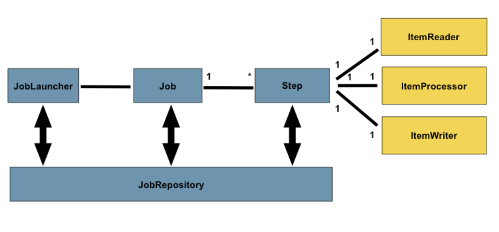

# 2. The Domain Language of Batch

[https://godekdls.github.io/Spring Batch/domainlanguage/](https://godekdls.github.io/Spring%20Batch/domainlanguage/)

스프링 배치 아키텍처

- 스프링 배치와 일반 배치와의 차별점
  - 명확한 관심사 분리
  - 인터페이스로 제공하는 명확한 아키텍처 레이어와 서비스
  - 빠르고 쉽게 적용하고 응용할 수 있는 간단한 디폴트 구현체
  - 크게 향상된 확장성
- 스프링 배치는 견고하고 유지보수 가능한 시스템에서 일반적으로 사용하는 레이어, 컴포넌트, 기술 서비스의 구현체를 제공핮ㄴ다.
- 이러한 인프라를 이용하여 단순한 배치부터 복잡한 배치까지 개발할 수 있다.
- 스프링 배치 다이어그램
  
- Job 하나는 1개 이상의 Step을 가지고 있다.
- Step은 ItemReader, ItemProcessor, ItemWrite를 가지고 있다.
- JobLauncher는 Job을 실행한다.
- JobRepository는 현재 실행중인 프로세스의 메타 정보가 저장되어 있다.

# 1. Job

- Job은 전체 배치 프로세스를 캡슐화한 엔티티.
- Job은 전체 계층 구조에서 가장 위에 있는 개념이다.
  
- Job의 구성 요소
  - Job의 이름
  - Step 인스턴스 정의와 순서
  - Job의 재시작 가능 여부
- 스프링 배치에서는 SimpleJob이라는 Job 인터페이스 구현체를 디폴트로 제공한다.
- Builder를 이용하여 Job을 생성할 수 있다.

```java
@Bean
public Job testJob(){
	return this.jobBuilderFactory.get("testJob")
							.start(playerLoad())
							.next(gameLoad())
							.next(playerSummarization())
							.end()
							.buiuld();
}
```

## 1.1 JobInstance

- JobInstance는 논리적인 Job 실행을 의미한다.
  - Job이라는 큰 틀이 존재하고, 그것들의 논리적인 구분이 JobInstance이다.
  - 1월1일에 실행하는 Job, 1월2일에 실행하는 Job 모두 Job이고,
  - 해당 JobInstance가 2개 있는 것이다.
- JobInstance는 실행 결과를 여럿 가질 수 있다.
- 특정 Job과 식별 가능한 JobParameters 에 상응하는 JobInstance는 단 한 개 뿐이다.
- JobInstance와 데이터 로드와는 관계가 없다(데이터 로드는 ItemReader와 관련이 있다.)
- JobInstance의 재사용 여부는 이전 실행에서 사용된 상태(ExceutionContext)를 그대로 사용할지 말지 결정한다.
- 새 JobInstance를 사용한다 == 처음부터 시작한다.
- 이전 JobInstance를 사용한다 == 멈추었던 곳에서부터 시작한다.

## 1.2 JobParameters

- JobParameters를 이용하여 JobInstance들을 구분한다.
- JobParameters는 배치 Job을 시작할 때 사용하는 파라미터 셋을 가진 객체이다.
- 즉, 실행중인 job을 식별하거나 참조 데이터로 사용이 가능하다.
- Job은 하나지만, JobParameter는 여러개가 존재할 수 있다.
- JobInstance = Job + Jobparameters
- JobParameters구조
  

## 1.3 JobExecution

- JobExecution은 실제 실행 중에 필요한 기본 스토리지 메커니즘을 제공한다.
- JobExecution은 Job을 한 번 실행하려 했다는 것을 의미한다.
- JobExecution이 성공하거나 실패하기 전까지 JobInstance는 완료되지 않은 것으로 간주된다.
- JobExecution은 많은 프로퍼티를 관리하고 유지한다.

[JobExecution Properties](https://www.notion.so/068e36a5bef2461c9789999674841d26)

# 2. Step

Step

- Step은 Job의 독립적이고 순차적인 단계를 캡슐화한 도메인 객체이다.
- 모든 Job은 하나 이상의 step으로 구성된다.
- Step은 실제 배치 처리를 정의하고 컨트롤하는데 필요한 모든 정보를 가지고 있다.
- Step을 구성하는 내용은 개발자의 재량이다.
- Step에도 JobExecution처럼 StepExecution이 존재한다.
- Step 구성도
  

## 2.1 StepExecution

StepExecution이란?

- StepExecution이란 한 번의 Step 실행 시도를 의미한다.
- JobExecution처럼 Step이 실제로 실행할 때마다 StepExecution이 생성된다.(실행 실패시 생성x)
- execution은 StepExecution 클래스 객체이다.
- execution은 실행/종료 시각, 커밋/롤백 횟수를 포함한 step, JobExecution, 트랜잭션 관련 데이터를 가지고 있다.
- 각 StepExecution은 ExecutionContext를 가지고 있다. 여기에 통계나 재시작 시 필요한 상태 정보 등 배치 작업 시 유지해야 하는 데이터가 있다.

[StepExecution Properties](https://www.notion.so/579c8c554afa4763801db6cf7faf04e4)

# 3. ExecutionContext

ExecutionContext란?

- 프레임워크에서 유지/관리하는 키/값 쌍의 컬렉션
- StepExecution 객체 또는 JobExecution 객체에 속하는 상태(Status)를 저장한다.
- ExecutionContext는 keyspace를 공유하기 때문에 데이터가 겹쳐 써지지 않도록 주의해서 사용해야 한다.
-

ExecutionContext 값을 이용하여 재실행

```java
if(executionContext.containskey(getKey(LINES_READ_COUNT))){
	long lineCnt = excutionContext.getLong(getKey(LINES_READ_COUNT));

	LineReader reader = getReader();

	Object record = "";
	while(reader.getPosition() < lineCnt && record != null){
		record = readLine();
	}
}
```

JobExecution의 ExecutionContext, StepExecution의 ExecutionContext

```java
ExecutionContext ecStep = stepExecution.getExecutionContext();
ExecutionContext ecJob = jobExecution.getExecutionContext();
// ecStep과 ecJob은 다른 ExecutionContext이다.
```

# 4. JobRepository

- JobRepository는 위 언급된 모든 저장(persistence) 메커니즘을 담당한다.
- JobLauncher, Job, Step 구현체에 CRUD 기능을 제공한다.
- Job 실행 시 레포지토리에서 JobExecution을 조회한다.
- 실행 중에는 StepExecution, JobExecution 구현체를 레포지토리에 넘겨 저장한다.
- @EnableBatchProcessing 어노테이션을 달아서 JobRepository를 자동으로 컴포넌트로 설정한다.

# 5. JobLauncher

- JobParameters로 Job을 실행하는 간단한 인터페이스
- JobRepository에서 유효한 JobExecution을 조회하고 Job을 실행하는 기능을 구현한다.

```java
public interface JobLauncher{

	public JobExecution run(Job job, JobParameters jobParameters)
		throws JobExecutionAlreadyRunningException , JobRestartException
			, JobInstanceAlreadyCompleteException, JobParametersInvalidException;

}
```

# 6. Item Reader

- Step에서 아이템을 한 번에 하나씩 읽어오는 작업을 추상화한 객체
- 아이템을 하나 read한다.
- 더 이상 읽을 아이템이 없으면 null을 리턴한다.

# 7. Item Writer

- Step에서 배치나 청크 단위로 아이템을 출력하는 작업을 추상화한 객체.
- 아이템 묶음을 write한다.
- 일반적으로 Item Writer는 다음에 받을 입력이 무엇인지는 알지 못하며, 현재 받은 아이템만 알고 있다.

# 8. Item Processor

- 아이템을 처리하는 비즈니스 로직을 나태내는 추상화 개념.
- 아이템 read, write가 아니라 데이터 변환이나 다른 비즈니스 처리를 담당한다.
- 데이터 처리 중 아이템이 유효하지 않는다고 판단하면 null을 리턴한다.(아이템이 write되면 안된다는 것을 의미한다.)
