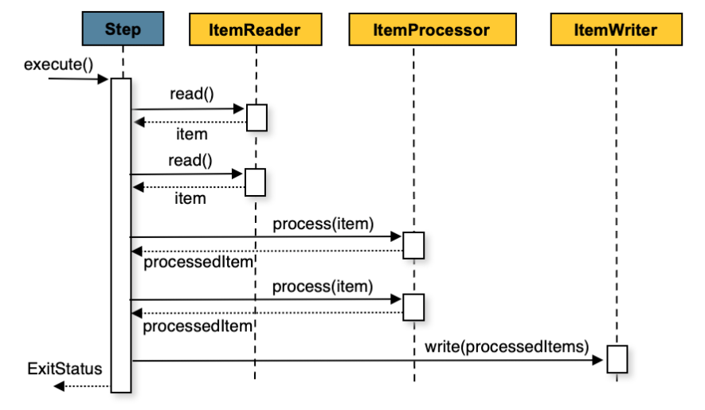

# 4. Configuring a Step

# 4.1 Chunk-oriented Processing

- 스프링 배치는 청크 지향(Chunk-oriented)으로 개발되었다.
- 청크 지향이란 트랜잭션 경계 내에 쓰여질 청크 단위로 개발하는 것을 의미한다.
  
- 즉, 청크 단위로 read → processor 과정을 거치고, 해당 청크 단위 만큼 진행되었다면 writer 작업을 진행한다.

```java
List items = new Arraylist();
for(int i = 0; i < commitInterval; i++){
    Object item = itemReader.read();
    if (item != null) {
        items.add(item);
    }
}

List processedItems = new Arraylist();
for(Object item: items){
    Object processedItem = itemProcessor.process(item);
    if (processedItem != null) {
        processedItems.add(processedItem);
    }
}

itemWriter.write(processedItems);
```

## 4.1.1 Configuring a step

- Step은 Spring Batch Buider를 통해 설정할 수 있다.

```java
@Bean
public Job sampleJob(JobRepository jobRepository, Step sampleStep){
	return this.jobBuilderFactory.get("sampleJob")
							.repository(jobRepository)
							.start(sampleStep)
							.build();
}

@Bean
public Step sampleStep(PlatformTransactionManager transactionManager){
	return this.stetpBuilderFactory.get("sampleStep")
							.transactionManager(transactionManager)
							.<String, String>chunk(10)
							.reader(itemReader())
							.writer(itemWriter())
							.build();
}
```

- 위 설정은 청크 지향 배치 시 필수 설정이다.
  - reader : 처리할 아이템을 제공하는 ItemReader
  - writer : ItemReader가 제공하는 아이템을 처리할 ItemWriter
  - transactionManager : 트랜잭션을 시작하고 커밋하는 스프링의 PlatforTransactionManager
  - repository : StepExecution과 ExecutionContext를 주기적으로(커밋 직전) 저장하는 JobRepository
  - chunck : 트랜잭션을 커밋하기 전까지 처리할 아이템 수
- @EnableBatchProcessing을 통해서 디폴트 레포지토리인 jobRepository와 디폴트 트랜잭션 매니저인 transactionManager가 제공된다.
- processing과정은 생략이 가능하다.

## 4.1.2 The Commit Interval

- 설정된 Commit Interval 값에 따라 PlatformTransactionManager를 사용하여 주기적으로 커밋한다.
- 위 예제에서는 commit-interval이 10이기 때문에(<String, String>chunk(10) ) 10번 실행 후 커밋이 실행된다.
- ItemReader의 read 메소드를 호출할 때마다 카운터가 증가한다.
- 카운터가 commit-interval 값이 되면 ItemWriter로 넘겨지고 트랜잭션이 커밋된다.

## 4.1.3 Configuring a Step for Restart

- Restart는 Step에 큰 영향을 주기 때문에 설정이 필요하다.

### Setting a Start Limit

- Step의 실행 횟수를 조절한다.
- Job마다 특정 Step은 한 번만 실행해야 하는 경우 등을 설정할 수 있다.
- startLimit(횟수) 옵션을 이용하여 해당 횟수만큼만 실행하도록 설정이 가능하다.
- 이 횟수 보다 많이 실행할 경우 StartLimitExceededException이 발생한다.
- start-limit의 디폴트 값은 Integer.MAX_VALUE 이다.

### Restarting a Completed Step

- 재시작 가능한 Job의 경우 첫 실행 성공 여부와 상관 없이 항상 실행하는 Step을 설정할 수 있다.
- 유효성 검증이나, 배치 전 리소스 정리 Step 등이 이 경우에 해당된다.
- 재시작된 Job을 처리하는 동안에는 COMPLETE 상태를 가진 Step은 스킵하게 된다.
- allow-start-if-complete가 true인 step은 항상 실행된다.

```java
@Bean
public Step step1(){
	return this.stepBuilderFactory.get("step1")
							.<String, String> chunk(10)
							.reader(itemReader())
							.writer(itemWriter())
							.allowStartIfComplete(true)
							.build();
}
```

## 4.1.4 Configuring Skip Logic

- 중간에 에러가 발생하더라도 무시하고 넘어갈 수 있도록 설정할 수 있다.
- `faultTolerant` , `skipLimit`, `skip` 을 설정하여 Skip Logic을 설정할 수 있다.

```java
@Bean
public Step step1() {
	return this.stepBuilderFactory.get("step1")
				.<String, String>chunk(10)
				.reader(flatFileItemReader())
				.writer(itemWriter())
				.faultTolerant()
				.skipLimit(10)
				.skip(Exception.class)
				.noSkip(FileNotFoundException.class)
				.build();
}
```

- java.lang.Exception이 발생하면 skip이 되고, 이 횟수는 10번을 넘길 수 없다.
- 11번 이상이 되는 순간 skip이 불가능하고, 예외를 발생한다.
- noSkip에 설정된 FileNotFoundException이 발생하는 경우 skip이 되지 않고 예외가 발생한다.
- skip과 noSkip 메소드 호출 순서는 아무런 상관이 없다.

## 4.1.5 Configuring Retry Logic

- 예외를 발생하거나 무시하는게 아니라, 재시도를 하도록 설정할 수 있다.

```java
@Bean
public Step step1() {
	return this.stepBuilderFactory.get("step1")
				.<String, String>chunk(2)
				.reader(itemReader())
				.writer(itemWriter())
				.faultTolerant()
				.retryLimit(3)
				.retry(DeadlockLoserDataAccessException.class)
				.build();
}
```

## 4.1.6 Controlling Rollback

- 기본적으로 재시도 여부와 상관없이 ItemWriter에서 발생하는 모든 예외는 Step에서 처리하는 트랜잭션을 롤백시킨다.
- ItemReader에서는 예외가 발생해도 skip이 설정되어 있는 예외라면 롤백이 일어나지 않는다.
- noRollback 옵션을 이용하여 롤백을 유발하지 않는 예외를 설정할 수 있다.

```java
@Bean
public Step step1() {
	return this.stepBuilderFactory.get("step1")
				.<String, String>chunk(2)
				.reader(itemReader())
				.writer(itemWriter())
				.faultTolerant()
				.noRollback(ValidationException.class)
				.build();
}
```

### Transactional Readers

- 롤백되는 트랜잭션 리소스보다 reader의 버퍼 큐가 상위에 있는 경우 메시지가 여전히 큐에 남아있을 수 있다.
- readerIsTransactionalQueue 옵션을 통해 Step이 버퍼를 사용하지 않도록 설정할 수 있다.

```java
@Bean
public Step step1() {
	return this.stepBuilderFactory.get("step1")
				.<String, String>chunk(2)
				.reader(itemReader())
				.writer(itemWriter())
				.readerIsTransactionalQueue()
				.build();
}
```

## 4.1.7 Transaction Attributes

- 트랜잭션의 고립 수준(isolation)과 전파(propagation), 타임 아웃을 설정할 수 있다.

```java
@Bean
public Step step1() {
	DefaultTransactionAttribute attribute = new DefaultTransactionAttribute();
	attribute.setPropagationBehavior(Propagation.REQUIRED.value());
	attribute.setIsolationLevel(Isolation.DEFAULT.value());
	attribute.setTimeout(30);

	return this.stepBuilderFactory.get("step1")
				.<String, String>chunk(2)
				.reader(itemReader())
				.writer(itemWriter())
				.transactionAttribute(attribute)
				.build();
}
```

## 4.1.8 Registering ItemStream with a Step

- Step 처리 동안 ItemStep 콜백을 처리해야 할 때 사용한다.
- Step이 실패 후 재시작 시 각 실행 상태에 대해 꼭 필요한 정보를 얻을 수 있는 매우 중요한 인터페이스를 제공한다.
- ItemStream 인터페이스를 ItemReader, ItemProcessor, ItemWriter 중 하나로 구현하면 자동으로 등록된다.
- 그 외 Stream 구현체는 별도로 등록해야 한다.
- delegate 등의 방법을 통해 간접적으로 위임할 수 있다.

## 4.1.9 Intercepting Step Execution

- Step에서는 각 단계에 맞는 리스터가 존재한다.
- 모든 StepListner를 확장한 구현체는 listener 메소드를 통해 Step에 등록할 수 있다.
- listener는 step, tasklet, chunk 단위로 사용할 수 있다.

### StepExecutionListener

- Step의 성공/실패 여부와 상관 없이 Step 시작 전, 후 실행

```java
public interface StepExecutionListener extends StepListener {

    void beforeStep(StepExecution stepExecution);

    ExitStatus afterStep(StepExecution stepExecution);

}
```

- afterStep에서 인자로 전달할 ExitStatus로 종료 상태를 변경할 수 있다.
- @BeforeStep / @AfterStep 어노테이션을 통해 동일한 기능을 할 수 있다.

### ChunkListener

- Chunk 처리 전, 처리 후, 에러가 발생한 경우

```java
public interface ChunkListener extends StepListener {

    void beforeChunk(ChunkContext context);
    void afterChunk(ChunkContext context);
    void afterChunkError(ChunkContext context);

}
```

- beforeChunk는 트랜잭션 시작 후 호출된다.(ItemReader의 read 메소드를 호출하기 전)
- afterChunk는 청크가 커밋된 후 호출(롤백되었다면, 호출되지 않는다.)
- 청크가 없어도 이 리스너를 사용할 수 있다.
  - TaskletStep이 ChunkListener를 호출한다.
- @BeforeChunk, @AfterChunk, @AfterChunkError 어노테이션을 통해 동일한 기능을 할 수 있다

### ItemReadListener

- ItemRead 처리 전, 후, 에러가 발생한 경우

```java
public interface ItemReadListener<T> extends StepListener {

    void beforeRead();
    void afterRead(T item);
    void onReadError(Exception ex);

}
```

- beforeRead 메소드는 ItemReader의 read 메소드를 호출하기 전 매번 호출된다.
- afterRead 메소드는 read 메소드 호출 성공 시 매번 호출되고, 읽은 아이템을 인자로 받는다.
- onReadError 메소드는 읽는 도중 에러가 발생한 경우 호출된다.
- @BeforeRead, @AfterRead, @OnReadError 어노테이션을 통해 동일한 기능을 할 수 있다.

### ItemProcessListener

- ItemProcess 처리 전, 후, 에러가 발생한 후

```java
public interface ItemProcessListener<T, S> extends StepListener {

    void beforeProcess(T item);
    void afterProcess(T item, S result);
    void onProcessError(T item, Exception e);

}
```

- beforeProcess 메소드는 ItemProcessor의 process 메소드 호출 전 호출된다.
- afterProcessor 메소드는 성공적으로 처리 후 호출된다.
- onProcessError 메소드는 처리 중 에러가 발생한 경우 호출된다.
- @BeforeProcess, @AfterProcess, @OnProcessError어노테이션을 통해 동일한 기능을 할 수 있다.

### SkipListener

- read, process, write 과정 중 스킵된 경우 발생

```java
public interface SkipListener<T,S> extends StepListener {

    void onSkipInRead(Throwable t);
    void onSkipInProcess(T item, Throwable t);
    void onSkipInWrite(S item, Throwable t);

}
```

- onSkipInRead 메소드는 아이템 읽는 동안 스킵 시 호출된다.
  - 롤백된 경우 같은 아이템이 여러 번 스킵된 걸로 간주할 수 있다.
- onSkipInWrite 메소드는 아이템을 쓰는 동안 스킵 시 호출된다.
- @OnSkipInRead, @OnSkipInProcess, @OnSkipInWrite어노테이션을 통해 동일한 기능을 할 수 있다.

### SkipLintensers and Transactions

- 기존 트랜잭션이 롤백되었다면, 여러 가지 이유가 있을 수 있기 때문에 스프링 배치는 두 가지를 보장한다.

1. 적절한 skip 메소드를 아이템마다 한 번만 호출한다.
2. SkipListener는 항상 트랜잭션이 커밋 되기 직전에 호출한다. 따라서 ItemWriter에서 오류가 발생해도 리스터에서 호출하는 트랜잭션까지 롤백되지 않는다.

# 4.2 TaskletStep

- Tasklet은 execute 메소드가 하나를 가진 인터페이스이다.
- execute 메소드는 RepeatStatus.FINISHED 가 리턴되거나 실패를 뜻하는 예외를 던지기 전까지 TaskletStep을 반복적으로 호출한다.
- 각 Tasklet 호출은 트랜잭션으로 감싸져 있다.
- TaskletStep을 생성하려면 빌더에 tasklet 메소드에 Tasklet 인터페이스를 구현한 빈을 넘겨야 한다.
- TaskletStep을 만들 때 chunk 메소드를 사용하면 안된다.

```java
@Bean
public Step step1() {
    return this.stepBuilderFactory.get("step1")
    			.tasklet(myTasklet())
    			.build();
}
```

## 4.2.1 TaskletAdapter

- Tasklet 인터페이스도 기존 클래스에 꽂아서 사용할 수 있는 어뎁터가 있다.
- TaskletAdapter를 사용하면, Tasklet 인터페이스를 위한 어뎁터를 직접 구현하지 않고도 이 클래스를 호출할 수 있다.

```java
@Bean
public MethodInvokingTaskletAdapter myTasklet() {
	MethodInvokingTaskletAdapter adapter = new MethodInvokingTaskletAdapter();

	adapter.setTargetObject(fooDao());
	adapter.setTargetMethod("updateFoo");

	return adapter;
}
```

# 4.3 Controlling Step Flow

## 4.3.1 Sequential Flow

- next attirbute를 사용해 flow를 구성할 수 있다.
  

```java
@Bean
public Job job() {
	return this.jobBuilderFactory.get("job")
				.start(stepA())
				.next(stepB())
				.next(stepC())
				.build();
}
```

- step A가 실패하면, 전체 Job이 실패로 끝나 step B는 실행되지 않는다.

## 4.3.2 Conditional Flow

- Step의 실패가 전체 실패가 아닌, 다른 Step을 실행하게 설정할 수 있다.
  
- next가 다음 step을 알려준 것 처럼 transition element를 사용하면 상태에 따라 다음 step을 정의할 수 있다.
- 한 step이 next attribute와 transition element를 둘 다 가질 수 없다.
- 자바 기반에서는 on 메소드에 간단한 패턴 매칭 스키마를 사용한 값을 넘겨주면 된다.
  - 이 값은 Step 실행 결과로 돌려 받는 ExitStatus와 매칭한다.
  - 패턴 안 특수문자는 두 가지만 허용된다.
  1. “\*” : 0개 이상의 문자와 매칭
  2. “?” : 정확히 1개의 문자와 매칭
- transition element 수에 제한은 없지만, step 결과로 받은 ExitStatus가 어떤 element와도 매칭되지 않는다면, 프레임워크는 예외를 발생시키고 Job은 실패한다.
- trainsition은 구체적인 것부터 그렇지 않은 순서로 적용한다.

```java
@Bean
public Job job() {
	return this.jobBuilderFactory.get("job")
				.start(stepA())
				.on("*").to(stepB())
				.from(stepA()).on("FAILED").to(stepC())
				.end()
				.build();
}
```

### Batch Status VS Exit Status

- Batch Status
  - Batch Status는 JobExecution과 StepExecution의 프로퍼티다.
  - Enumeration 이며, Job과 Step의 상태를 나타낸다.
  - `COMPLETED`, `STARTING`, `STARTED`, `STOPPING`, `STOPPED`, `FAILED`, `ABANDONED`, `UNKNOWN` 가 있다.
- Exit Status
  - Exit Status는 Step이 실행이 종료된 후 Step 상태를 가지고 있다.

## 4.3.3 Configuring for Stop

- Step의 상태는 실행되는 코드로 결정되는 반면, Job의 상태는 설정에 따라 달라진다.
- 커스텀한 Job 종료 시나리오를 위해 스프링 배치는 Job을 종료시키기 위한 transition element 세 가지를 지원한다.
- stopping element는 Job을 종료시키면서 BatchStatus를 적절한 값으로 설정해둔다.
- stop transition element는 Step의 BatchStatus, ExitStatus에는 영향을 주지 않고, Job의 최종 상태만 변경한다.

### Ending at a Step

- end 메소드는 Job의 ExitStatus를 커스텀할 수 있는 exitStatus 파라미터를 넘길 수도 있다.
- exitStatus 파라미터를 넘기지 않았다면, ExitStatus를 디폴트 값인 COMPLETED로 설정해 BatchStatus와 통일시킨다.

```java
@Bean
public Job job() {
	return this.jobBuilderFactory.get("job")
				.start(step1())
				.next(step2())
				.on("FAILED").end()
				.from(step2()).on("*").to(step3())
				.end()
				.build();
}
```

### Failing a Step

- 특정 step이 실패한 경우에만 BatchStatus를 FAILED로 설정하고, Job을 중단하는 방법도 있다.
- end 메소드와 다르게 Job이 실패해도 재시작할 수 있다.

```java
@Bean
public Job job() {
	return this.jobBuilderFactory.get("job")
			.start(step1())
			.next(step2()).on("FAILED").fail()
			.from(step2()).on("*").to(step3())
			.end()
			.build();
}
```

- step2가 실패하면, Job의 BatchStatus는 FAILED, ExitStatus는 EARLY TERMINATION으로 종료되고, step3는 실행되지 않는다. 또한 Job 재시작 시 step2 부터 다시 실행한다.
- step2가 성공하면, step3를 실행한다.

### Stoppin a Job at a Given Step

- 특정 Step에서 작업을 중단하도록 설정하면, BatchStatus가 STOPPED인 상태로 Job이 종료된다.
- stopAndRestart 메소드에 Job이 다시 실행됐을 때 실행할 step을 넘겨야 한다.

```java
@Bean
public Job job() {
	return this.jobBuilderFactory.get("job")
			.start(step1()).on("COMPLETED").stopAndRestart(step2())
			.end()
			.build();
}
```

- step1이 COMPLETE로 끝나면 job을 중단하고, 재시작 시 step2를 실행한다.

## 4.3.4 Programmatic Flow Decisions

- ExitStatus 이외의 다른 정보를 바탕으로 step을 결정할 수 있다.
- JobExecutionDecider를 구현한 빈을 next 호출부로 직접 넘긴다.

```java
public class MyDecider implements JobExecutionDecider {
    public FlowExecutionStatus decide(JobExecution jobExecution, StepExecution stepExecution) {
        String status;
        if (someCondition()) {
            status = "FAILED";
        }
        else {
            status = "COMPLETED";
        }
        return new FlowExecutionStatus(status);
    }
}

@Bean
public Job job() {
	return this.jobBuilderFactory.get("job")
			.start(step1())
			.next(decider()).on("FAILED").to(step2())
			.from(decider()).on("COMPLETED").to(step3())
			.end()
			.build();
}
```

## 4.3.5 Split Flows

- 스프링 배치는 병렬 플로우를 지원한다.

```java
@Bean
public Job job() {
	Flow flow1 = new FlowBuilder<SimpleFlow>("flow1")
			.start(step1())
			.next(step2())
			.build();
	Flow flow2 = new FlowBuilder<SimpleFlow>("flow2")
			.start(step3())
			.build();

	return this.jobBuilderFactory.get("job")
				.start(flow1)
				.split(new SimpleAsyncTaskExecutor())
				.add(flow2)
				.next(step4())
				.end()
				.build();
}
```

# 4.4 Late Binding of Job and Step Attributes

- 스프링 배치를 사용하면, Job이나 Step의 attribute 값을 나중에 바인딩할 수 있다.

```java
@StepScope
@Bean
public FlatFileItemReader flatFileItemReader(@Value("#{jobParameters['input.file.name']}") String name) {
	return new FlatFileItemReaderBuilder<Foo>()
			.name("flatFileItemReader")
			.resource(new FileSystemResource(name))
			...
}
```

```java
@StepScope
@Bean
public FlatFileItemReader flatFileItemReader(@Value("#{jobExecutionContext['input.file.name']}") String name) {
	return new FlatFileItemReaderBuilder<Foo>()
			.name("flatFileItemReader")
			.resource(new FileSystemResource(name))
			...
}
```

```java
@StepScope
@Bean
public FlatFileItemReader flatFileItemReader(@Value("#{stepExecutionContext['input.file.name']}") String name) {
	return new FlatFileItemReaderBuilder<Foo>()
			.name("flatFileItemReader")
			.resource(new FileSystemResource(name))
			...
}
```

## 4.4.1 Step Scope

- Step 시작 전까지는 빈을 초기화할 수 없으므로 late binding을 사용하기 위해서는 Step scope 선언이 필수적이다.

1. batch 네임스페이스를 사용한다.
2. StepScope 빈을 정의한다.
3. @EnableBatchProcessing을 사용한다.

```xml
batch 네임스페이스 사용
<beans xmlns="http://www.springframework.org/schema/beans"
       xmlns:batch="http://www.springframework.org/schema/batch"
       xmlns:xsi="http://www.w3.org/2001/XMLSchema-instance"
       xsi:schemaLocation="...">
<batch:job .../>
...
</beans>
```

```xml
StepScope 빈 정의 사용
<bean class="org.springframework.batch.core.scope.StepScope" />
```

## 4.4.2 Job Scope

- Job scope는 Step scope와 유사하지만, Job 컨텍스트를 위한 Scope이기 때문에 이 빈의 인스턴스는 실행 중인 Job 마다 하나씩만 가지고 있다.
- job이나 job 실행 컨텍스트, job 파라미터로부터 빈 프로퍼티를 가져올 수 있다.
- scope는 스프링 컨테이너 기본 기능이 아니기 때문에 명시적으로 추가해야 한다.

1. batch 네임스페이스를 사용한다.
2. JobScope 빈을 정의한다.
3. @EnableBatchProcessing을 사용한다.

```xml
batch 네임스페이스 사용
<beans xmlns="http://www.springframework.org/schema/beans"
		  xmlns:batch="http://www.springframework.org/schema/batch"
		  xmlns:xsi="http://www.w3.org/2001/XMLSchema-instance"
		  xsi:schemaLocation="...">

<batch:job .../>
...
</beans>
```

```xml
JobScope 빈 정의 사용
<bean class="org.springframework.batch.core.scope.JobScope" />
```
