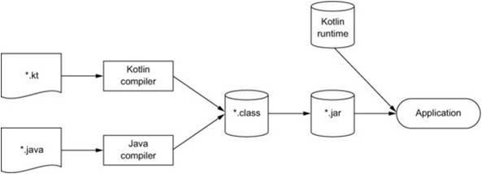

# 1. 코틀린이란 무엇이며, 왜 필요한가?

(Kotlin In action를 정리한 내용입니다.)

## 1. 코틀린이란?

- 자바 플랫폼에서 돌아가는 새로운 프로그래밍 언어
- 간결하고 실용적이며, 자바 코드와 상호운용성을 중시한다.
  - 대부분의 자바를 사용하는 곳에서는 코틀린을 사용할 수 있다.
  - 기존 자바 라이브러리랑 프레임워크와 함께 잘 작동한다.
  - 성능도 자바와 같다.

## 2. 코틀린의 주요 특성

### 2-1. 다양한 플랫폼

코틀린은 현재 자바가 사용중인 모든 곳에서 사용할 수 있다.

- 서버(백엔드)
- 안드로이드 등

자바 뿐만 아니라 자바스크립트로도 코틀린을 컴파일 할 수 있다.
⇒ 즉, 브라우저나 노드에서도 코틀린을 실행할 수 있다.

### 2-2. 정적 타입 지정 언어

정적 타입 지정 언어른 요소 타입을 컴파일 시점에 알 수 있고, 컴파일러가 객체의 필드나 메소드 사용 시 타입을 검증해주는 언어이다.

<br>

정적 타입의 장점으로는 성능, 신뢰성, 유지 보수성, 도구 지원 등이 있다.

- 성능 : 실행 시점에 어떤 메소드를 호출할 지 알아내는 과정이 없기 때문에 빠른 메소드 호출이 가능하다.
- 신뢰성 : 컴파일러가 프로그램의 정확성을 검증하기 때문에 실행 시 프로그램이 오류로 중단될 가능성이 적어진다.
- 유지 보수성 : 객체가 어떤 타입인지 알 수 있기 때문에 코드를 더 쉽게 다룰 수 있다.
- 도구 지원 : 정적 타입을 이용하여 안전한 리펙토링과 정확한 코드 완성 등을 할 수 있다.

<br>

하지만 자바와 다르게, 타입 추론을 지원하기 때문에 모든 변수의 타입을 명시하지 않아도 된다.

⇒ 코틀린 컴파일러가 문맥으로부터 변수 타입을 자동으로 유추해준다.

<br>

코틀린과 자바의 가장 큰 차이점은 nullable 타입의 지원이다.

nullable을 지원하여 컴파일 시 null pointer exception 발생 여부를 검사하여 프로그램의 신뢰성을 높일 수 있다.

<br>

또한, 코틀린은 function 타입을 지원한다.

### 2-3. 함수형 프로그래밍과 객체지향 프로그래밍

함수형 프로그래밍의 핵심 개념은 일급 시민인 함수, 불변성, 부수 효과 제거이 있다.

- 일급 시민(first-class) : 함수를 변수에 저장하거나 함수 인자로 다른 함수를 전달하는 것과 같이 일반 값 처럼 다루는 것.
- 불변성(Immutability) : 일단 만들어지면, 내부 상태가 절대 변하지 않는 불변 객체를 사용해 프로그램을 작성하는 것.
- 부수 효과(Side Effect) 제거 : 순수 함수를 사용하기 때문에 입력이 같으면 항상 출력이 같고, 함수 외부나 바깥 환경과 상호작용하지 않는 것.

<br>

함수형 프로그래밍의 장점으로는 3가지가 있다.

1. 간결성

   - 함수를 값처럼 활용하기 때문에 강력한 추상화를 하여 코드 중복을 막을 수 있다.
   - 예를 들어 람다 식을 이용하여 중복된 부분을 함수의 인자로 전달할 수 있다.

   ```java
   fun findAllice() = findPerson{ it.name == "Alice" }
   fun findBob() =  findPerson{ it.name == "Bob" }
   ```

2. 멀티 스레드 환경에서의 안전성(Safe Muiltithreading)
   - 멀티 스레드 환경에서 가장 큰 문제는 데이터 동기화이다.
   - 불변 데이터 구조와 순수 함수를 통해 다중 스레드 환경에서도 동기화 관련 문제를 해결할 수 있다.
3. 쉬운 테스트
   - 부수 효과가 있는 경우 테스트를 위한 준비 코드가 필요하지만, 순수 함수는 그런 준비가 필요 없다.

<br>

함수형 프로그래밍은 언어와 관계 없이 작성할 수 있다. 당연히 자바에서도 가능하다.

하지만, 모든 언어에서 함수형 프로그래밍을 편리하게 사용할 수 있는 라이브러리와 문법을 지원하는 것은 아니다.

예를 들어 자바8 이전에는 함수형 프로그래밍을 지원할 수 있는 기능이 거의 없었다.

**코틀린에서는 처음부터 함수형 프로그래밍을 풍부하게 지원해 왔다.**

- 함수 타입을 지원하여 함수를 파라미터로 받거나 반환할 수 있다.
- 람다 식을 지원하여 코드 블록을 쉽게 정의하고 전달할 수 있다.
- 데이터 클래스를 지원하여 불변 값 객체를 간편하게 만들 수 있도록 지원한다.
- 코트린 표준 라이브러리를 이용하여 객체와 컬렉션을 함수형 스타일로 다룰 수 있는 API를 지원한다.

<br>

다만, 코틀린에서는 함수형 프로그래밍 스타일을 지원할 뿐, 강제하지는 않는다.

### 2-4. 무료 오픈소스

코틀린 언어, 컴파일러, 라이브러리 등 모든 도구는 오픈소스이며 아파치2 라이선스하에 제공된다.

### 2-5. 코틀린의 성능 측면

코틀린 컴파일러가 생성한 바이트 코드는 일반 자바 코드와 똑같은 효율을 가지기 때문에 성능 측면에서 아무런 손해가 없다.

<br>

또한, 대부분의 코틀린 표준 라이브러리의 인자로 받은 람다 함수는 인라이닝(inlining)되기 때문에 람다 식을 사용해도 새로운 객체가 만들어지지 않는다.

<br>

즉, 객체 증가로 인한 GC(Garbage Collection)이 늘어나서 프로그램이 멈추는 일이 자주 발생하지 않는다.

## 3. 코틀린 응용

### 3-1. 서버 프로그래밍

서버 사이드에서 자주 사용하는 자바 코드와 매끄럽게 상호운용할 수 있다.

코틀린을 이용하여 새로운 컴포넌트를 작성하거나 기존 서비스 코드를 코틀린으로 이식해야 하는 경우 잘 맞는다.

뿐만 아니라 다양한 코틀린의 간결한 DSL(Domain Specific Language)을 제공한다.

### 3-2. 안드로이드 프로그래밍

코틀린 언어의 특성과 안드로이드 프레임워크의 특별한 컴파일러 플러그인 지원을 조합하여 안드로이드 개발 생산성을 높일 수 있다.

<br>

컨트롤 리스너를 추가하거나 레이아웃 요소를 필드와 바인딩 하는 등 개발 작업을 더 간결하게 할 수 있다.

## 4. 코틀린의 철학

### 4-1. 실용성

코틀린의 설계는 다년간 대규모 시스템을 개발한 IT 경험과 여러 내부 피드백이 반영되어 개발된 언어이다.

<br>

연구를 위한 언어가 아니기 때문에 최신 프로그래밍 언어 설계를 앞서 채택하고 연구 중인 혁신 아이디어를 채틱하는 것이 아니라

다른 프로그래밍 언어가 채택한 이미 성공적이고 검증된 해법과 기능을 채택했다.

이를 통해 언어의 복잡도를 줄이고, 이미 알고 있는 개념을 통해 더욱 쉽게 학습할 수 있다.

<br>

코틀린은 특정 프로그래밍 스타일이나 패러다임을 사용하도록 강제하지 않는다.

<br>

그리고 코틀린의 강력한 특성을 잘 활용하여 간결하게 코드를 작성할 수 있다.

<br>

또한, IDE 지원을 통해 생산성을 향상 시킬 수 있다.

인텔리제이에서는 더 간결한 구조로 바꿀 수 있는 대부분의 코드 패턴을 자동으로 감지하고 수정하라고 제안한다.

### 4-2. 간결성

개발을 하면서 가장 많은 시간을 투자하는 부분은 기존 코드를 분석하는 것이다.

코드가 간단하고 간결하면, 기존 코드 내용을 분석하고 파악하기 쉽다.

간결한 언어라는 것은 그 언어로 작성된 코드를 읽을 때 의도를 쉽게 파악할 수 있는 구문을 제공하고, 의도를 달성하는 방법을 이해할 때 방해가 될 수 있는 부가적인 준비 코드가 적다는 것이다.

<br>

코틀린에서는 의미 없는 코드 부분와 꼭 넣어야 하는 부수적인 요소를 줄였다.

예를 들어, getter와 setter, 생성자 파라미터 대입 로직 등 자바에서 자주 사용하지만 번거로운 준비 로직을 묵시적으로 제공한다.

<br>

또한 명시적으로 작성해야 하는 코드의 양이 상당히 많이 줄였다.

반복되거나 길어질 수 있는 코드는 표준 라이브러리를 통해 대치할 수 있고, 람다를 지원하여 작은 코드 블록을 라이브러리에 쉽게 전달한다.

### 4-3. 안전성

안전한 프로그래밍 언어라는 것은 프로그램에서 발생할 수 있는 오류 중 일부 유형의 오류를 프로그래밍 설계 단계에서 방지할 수 있다는 것이다.

안전한 프로그래밍을 하기 위해서는 컴파일러에게 많은 정보를 전달해야 하기 때문에 생산성이 하락하게 된다.

즉, 안전성과 생산성 사이에는 trade off 관계가 성립한다.

<br>

코틀린은 JVM을 사용하기 때문에 메모리 안정성이나 버퍼 오버플로 방지, 동적 메모리 할당 문제 방지 등 이미 상당한 안정성을 보장한다.

또한 정적 타입 지정 언어이기 때문에 타입 안정성도 보장한다.

<br>

그리고 자바보다 더 적은 비용으로 타입 안정성을 사용할 수 있다.

(컴파일러가 자동으로 타입을 추론하기 때문에 직접 정보를 지정할 필요가 없다.)

실행 시점 오류 대신 컴파일 시점 검사를 통해 오류를 더 많이 방지할 수 있다.

- nullable 지원을 통한 NullPointerException 방지
- 어떤 객체를 다른 객체 타입으로 Cast 시 발생하는 ClassCastException 방지
  - 타입 검사와 캐스팅을 한 연산자를 통해 간단하게 지원한다.
  - 검사를 통과하면, 해당 객체의 메소드와 필드 등을 별도의 캐스팅 없이 사용할 수 있다.

```java
if(value is String) { // 타입 검사
	println(value.toUpperCase()) // 해당 타입의 메소드 사용
}
```

### 4-4. 상호운용성

코틀린은 자바의 라이브러리를 그대로 사용할 수 있기 때문에 어떠한 API를 제공하던 간에 그 API를 활용할 수 있다.

자바의 상속이나 인터페이스 구현, 어노테이션을 사용 등을 코틀린에서 그대로 사용할 수 있다.

<br>

또한 코틀린에서 자바 코드 호출이나 자바에서 코틀린 코드 호출 역시 가능하다.

그렇기 때문에 자바와 코틀린 코드를 프로젝트에서 원하는 대로 섞어 쓸 수 있다.

<br>

코틀린에서는 자체 컬렉션 라이브러리를 제공하지 않고, 자바 표준 라이브러리를 제공하기 때문에 자바 API 호출 시 객체를 감싸는 등 변환이 필요 없다.

<br>

즉, 정리하자면

- 자바와 코틀린 소스 파일을 자유롭게 내비게이션 할 수 있다.
- 여러 언어로 이루어진 프로젝트를 디버깅하고 서로 다른 언어로 작성된 코드를 언어와 관계 없이 한 단계씩 실행할 수 있다.
- 자바 메소드를 리팩토링해도, 그 메소드와 관련 있는 코틀린 코드까지 제대로 변경된다. 역도 제대로 변경된다.

## 5. 코틀린 도구

### 5-1. 코틀린 코드 컴파일

코틀린은 .kt라는 확장자를 가진다.

코틀린 컴파일러는 자바처럼 코틀린 소스코드를 분석하여 .class 파일을 만든다.

코틀린은 코틀린 런타임 라이브러리에 의존하기 때문에 배포 시 함께 배포해야 한다.

코틀린 런타임 라이브러리는 코틀린에서 자바 API 기능을 확장한 내용이 들어 있다.


