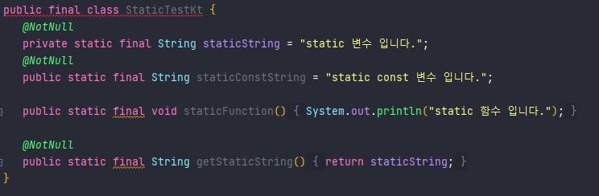

# 3장. 함수 정의와 호출

# 3. 함수 정의와 호출

## 3.1 코틀린에서 컬렉션 만들기

코틀린에서 컬렉션을 만드는 방법은 2장에서 본 것 처럼 of를 이용하면 된다.

```kotlin
val set = hashSetOf(1, 7, 35)

// 여기서 to는 특별한 키워드가 아니라, 일반 함수다.
val map = hashMapOf(1 to "one", 7 to "seven")
```

여기서 만들어지는 컬렉션들은 java의 컬렉션과 같은 것이다.

코틀린은 독자적인 컬렉션을 만드는 것이 아니라, 기존 java 컬렉션을 이용한다.

또한, 기존의 java에서 제공하는 기능보다 더 많은 기능을 제공한다.

즉, 코틀린 컬렉션 = 자바의 컬렉션 + a

```kotlin
val strings = listOf("first", "second", "fourtheenth")
println(strings.last())

val numbers = setOf(1, 14, 2)
println(numbers.max())
```

## 3.2 함수를 호출하기 쉽게 만들기

코틀린에서의 컬렉션은 기본적으로 toString이 구현되어 있다.

```kotlin
>>> val list = listOf(1, 2, 3)
>>> println(list)
[1, 2, 3]
```

### 3.2.1 이름 붙인 인자

기존 자바에서(JDK 1.8 미만)는 파라미터가 여러개인 경우, 구분이 힘들었다.

어떤 파라미터에 어떠한 값이 들어가는지 한눈에 파악하기 힘들었지만, 코틀린에서는 이름에 직접 대입을 하여 구분하기 쉽게 구현할 수 있다.

다만, 주의할 점은 이름을 붙인 파라미터와 그렇지 않은 파라미터가 섞일 경우 앞에서부터는 이름을 붙이지 않은 파라미터를 써야 한다.

```kotlin
fun testFunction(
	name1: String,
	name2: String,
	list: List<Int>,
	num1: Int,
	num2: Int,
	num3: Int
)

// Java
testFunction("string1", "string2", list, 3, 6, 9)

//kotilin - 가능
testFunction(name2 = "string2", name1 = "string1", num2 = 6, num3 = 9, num1 = 3, list = listOf())

//kotilin - 가능
testFunction("string1", "string2", num2 = 6, num3 = 9, num1 = 3, list = listOf())

//kotilin - 불가능
testFunction(list, 3, name2 = "string2", name1 = "string1", num2 = 6, num3 = 9)
```

### 3.2.2 디폴트 파라미터 값

코틀린에서는 함수의 파라미터의 디폴트 값을 설정할 수 있다.

디폴트 값을 설정함으로 오버로딩의 경우를 줄일 수 있다.

주의할 점으로는 위와 같이 앞에서부터 값을 채워야 한다는 것이다.

즉, 생략이 가능한 것은 뒤에 원소들이라는 것이다.

또한, 이름을 통해 순서와 상관 없이 값을 대입할 수 있다.

```kotlin
fun testFunction(
	name1: String = "",
	name2: String = "",
	list: List<Int> = listOf(),
	num1: Int = 0,
	num2: Int = 0,
	num3: Int = 0
)

// 가능
testFunction("string1", "string2")

// 가능
testFunction("string1", num3 = 3, name2 = "string2")

// 불가능
testFunction(3, 4, 5)
```

### 3.2.3 정적인 유틸리티 클래스 없애기: 최상위 함수와 프로퍼티

코틀린에서는 최상위 수준인 모든 다른 클래스 밖에 위치하게 되면, 정적인 함수나 값으로 사용할 수 있다.

다만, 다른 패키지에서 사용해야 하는 경우 해당 패키지를 import 해야 한다.

```kotlin
package test

class testClass{
}

fun funTest() {
}

///////////////////////////////////////////

package otherP

import test.funTest

class otherClass{
	fun otherFun() {
		funTest()
	}
}
```

이 과정에서 JVM는 해당 정적 함수를 위해 클래스를 생성해준다.

이때 만들어주는 클래스는, 해당 파일의 이름+Kt이다.

즉, 위 예제에서는 파일의 이름이 fileName이라면 fileNameKt 라는 이름의 클래스가 만들어진다.

이러한 것은 함수 뿐만 아니라 프로퍼티도 가능하다.

프로퍼티를 사용하면서, final 키워드를 붙이고 싶다면 const 키워드를 붙여주면 된다.

val 키워드만 붙여주게 되면, getter를 생성하고 접근하게 된다.

const를 같이 붙여 const val이 되면, 그 값 자체에 접근할 수 있다.

하지만, const는 원시 타입과 String 타입의 프로퍼티만 가능하다는 단점이 있다.

```kotlin
package test

class StaticTest {
}

fun staticFunction() {
    println("static 함수 입니다.");
}

val staticString = "static 변수 입니다."
const val staticConstString = "static const 변수 입니다."
```

이 파일을 컴파일하게 되면 StaticTestKt.class라는 파일이 별도로 나오고,
이 클래스 파일을 다시 java로 디컴파일하게 되면 다음과 같다.



## 3.3 메소드를 다른 클래스에 추가: 확장 함수와 확장 프로퍼티

코틀린에서는 기존에 정의된 클래스를 확장한 메소드를 만들 수 있도록 기능을 제공한다.

함수의 이름 앞에 확장하려는 객체 이름만 붙이면 된다.

```kotlin
fun String.lastChar(): Char = this.get(this.legnth - 1)

```

이러한 것은, 함수뿐만 아니라 프로퍼티도 가능하다.
다만, 직접 객체에 추가하는게 아니기 때문에 값을 가지는 것은 아니다.

```kotlin
var StringBuilder.lastChar: Char
	get() = get(length-1)
	set(value: Char) {
		this.setCharAt(length-1, value)
	}

```

### 확장 함수 주의 점

1. 수신 객체 자체에도 접근할 수 있고, 해당 멤버 변수나 메소드에도 접근할 수 있다.

   하지만, private, protected는 접근할 수 없다.

   그 이유는, 확장 함수가 직접 클래스 안에 선언되는 것이 아니기 떄문이다.
   실제 컴파일 되는 과정을 보면 해당 클래스를 받아 실행하는 형태로 만들어지기 때문에 private, protected 접근할 수 없다.

2. 확장 함수를 정의한다고 하더라도, 프로젝트 안에서 모두 사용할 수 있는 것은 아니다.

   해당 함수를 임포트 해야 사용할 수 있다.

3. 확장 함수는 오버라이딩이 불가능하다.

   객체를 상속 받고, 그 객체가 상위 객체로 선언하게 되는 경우, 확장 함수는 상위 객체 값을 실행한다.

```kotlin
open class View {

}

class Button: View() {

}

fun View.show() = println("view")

fun Button.show() = println("button")

val view: View = Button()

// view가 출력된다.
view.show()

```

4. 또한, `같은 이름`의 `멤버 함수`와 `확장 함수`가 존재한다면 `멤버 함수`를 실행하게 된다.
