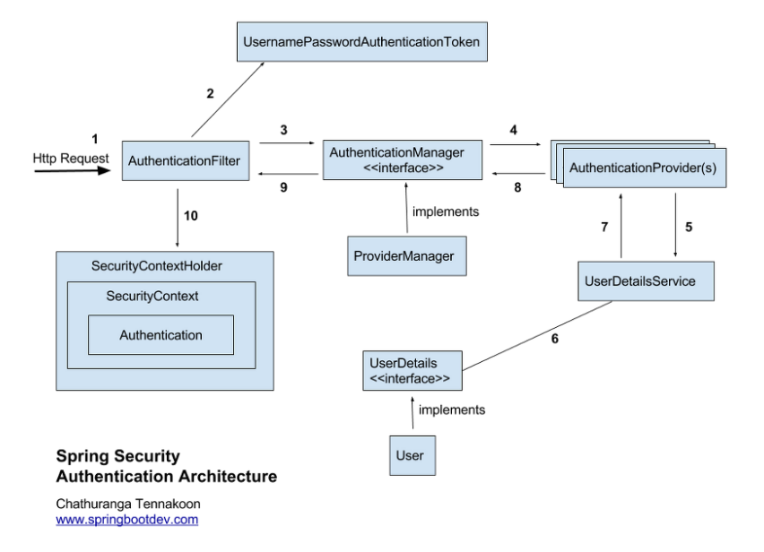

# Authentication

[https://godekdls.github.io/Spring Security/contents/](https://godekdls.github.io/Spring%20Security/contents/)

# 과정 정리



1. 클라이언트에서 인증 요청(로그인)
2. AuthenticationFilter에서 id / pw 기반으로 token 발급(Authentication)
3. 해당 토큰값을 AuthenticationManager를 구현한 ProviderManager에 넘긴다.
4. ProviderManager는 AuthenticationProviders 를 실행한다.
   1. ProviderManager에 여러 Provider들을 등록할 수 있다.
5. Providers에서 token일 이용하여 디비에 저장된 값을 가져오기 위해 UserDetailsService를 실행한다.
   1. UserDetailsService는 사용자가 생성한 bean이다.
6. UserDetailService에서 token을 바탕으로 인증에 성공한 경우 UserDetails를 가져온다.
   1. UserDetails를 구현한 User 객체
7. 가져온 값 리턴
8. 가져온 값 리턴
9. 가져온 값 리턴
10. 인증된 정보를 Authentication에 저장하고, Authentication은 SecurityContext에 저장하고, SecurityContext는 SecurityContextHolder에 저장한다.

⇒ 인가된 사용자인 경우, SecurityContextHolder → SecurityContext → Authentication에 회원 정보가 저장되어 있다.

## 요약

1. 유저가 로그인 시도(http request)
2. AuthenticationFilter 에서부터 위 과정을 거쳐 UserDB에서 정보를 가져온다.
3. 정상적인 유저라면 UserDetails로 정보를 가져와 session을 생성한다.
4. Spring Security의 인메모리 세션 저장소인 SecurityContextHolder에 저장한다.
5. 유저에게 session ID와 함께 응답을 내려준다.
6. 이후 요청 시 요청 쿠키에서 JESSIONID를 통해 검증 후 유효하면 Authentication을 쥐어준다.

# Architecture Components

- SecurityContextHolder
  - 스프링 시큐리티에서 인증한 대상에 대한 상세 정보를 저장한다.
- SecurityContext
  - SecurityContextHolder로 접근할 수 있으며, 현재 인증한 사용자의 Authentication을 가지고 있다.
- Authentication
  - 사용자가 제공한 인증용 Credential이나, SecurityContext에 있는 현재 사용자의 credential을 제공하며, Authentication의 입력으로 사용한다.
- GrantedAuthority
  - Authentication에서 접근 주체(principal)에 부여한 권한(i.e role, scope 등)
- AuthenticationManager
  - 스프링 시큐리티의 필터가 인증을 어떻게 수행할지를 정의하는 API
- ProviderManager
  - 가장 많이 사용하는 AuthenticationManager 구현체
- AuthenticationProvider
  - ProviderManager가 특정 인증 유형을 수행할 때 사용한다.
- AuthenticationEntryPoint
  - 클라이언트에 credential을 요청할 때 사용한다.
  - (i.e. 로그인 페이지로 리다이렉트하거나 WWW-Authenticate 헤더를 전송하는 등)
- AbstractAuthenticationProcessingFilter
  - 인증에 사용할 Filter의 베이스
  - 필터를 잘 이해하면 여러 컴포넌트를 조합해서 심도 있는 인증 플로우를 구성할 수 있다.

# 10.1 SecurityContenxtHolder


- SecurityContextHolder는 스프링 시큐리티로 인증한 사용자의 상세 정보를 저장한다.
- 값이 있다면, 현재 인증한 사용자 정보로 사용한다.
- 사용자가 인증되었음을 나타내는 가장 쉬운 방법은 직접 SecurityContextHolder를 설정하는 것이다.
  - ⇒ SecurityContextHolder에 값을 설정하여, 인증을 확인할 수 있다.

## SecurityContextHolder 설정

```java
// 1. 비어있는 SecurityContext를 만든다.
SecurityContext context = SecurityContextHolder.createEmptyContext();

// 2. 새 Authentication 객체를 생성한다.
// Authentication 구현체라면 모두 SecurityContext에 담을 수 있다.
Authentication authentication = new UsernamePasswordAuthenticationToken(userDetail, password, authorities);

// 3. SecurityContextHolder에 SecurityContext를 설정해 준다.
// 스프링 시큐리티는 이 정보를 사용하여 권한을 인가한다.
SecurityContextHolder.setConext(context);
```

## 인증된 주체(principal) 정보 얻기

```java

// SecurityContextHolder는 ThreadLocal을 사용해서 정보를 저장한다.
// 그렇기 때문에 동일한 스레드라면 항상 SecurityContext에 접근할 수 있다.
// 스프링 시큐리티의 FilterChainProxy는 항상 SecurityContext를 비워준다.
SecurityContext context = SecurityConextHolder.getContext();

Authentication authentication = context.getAuthentication();

String username = authentication.getName();

Object principal = authentication.getPrincipal();

Collection<? extends GrantedAuthority> authorites = authentication.getAuthorities();

```

# 10.2 SecurityContext

- SecurityContextHolder에서 SecurityContext를 접근할 수 있다.
- SecurityContext는 Authentication 객체를 가지고 있다.

# 10.3 Authentication

- AuthenticaionManager의 입력으로 사용되어, 인증에 사용할 사용자의 credential을 제공한다.
- 현재 인증된 사용자를 나타낸다.
- 현재 Authenticaion은 SecurityContext에서 가져올 수 있다.
- Authentiation의 정보
  - principal - 사용자를 식별한다. 사용자의 이름 / 비밀번호로 인증할 땐 보통 UserDetail 인스턴스이다.
  - credentials - 주로 비밀번호이다. 대부분은 유출되지 않도록 사용자를 인증한 다음 비운다.
  - authorities - 사용자에게 부여한 권한은 GrantedAuthority로 추상화한다.

# 10.4 GrantedAuthority

- 사용자에게 부여한 권한을 GrantedAuthority로 추상화 한다.
- Authenticaion.getAuthorites() 메소드를 이용하여 GrantedAuthority에 접근할 수 있다.
- 이름 / 비밀번호 기반 인증을 사용한다면, 일반적을 UserDetailService가 GrantedAuthority를 로드한다.

# 10.5 AuthenticationManager

- 스프링 시큐리티 필터의 인증 수행 방식을 정의하는 API
- AuthenticaionManager를 호출한 객체는 매니저가 리턴한 Authentication을 SecurityContextHolder에 설정한다.
- 스프링 시큐리티 Filter를 사용하지 않는다면, AuthenticationManager를 사용할 필요 없이 직접 SecurityContextHolder를 설정하면 된다.
- 일반적으로 AuthenticationManager 구현체는 ProviderManager를 사용한다.

# 10.6 ProviderManager


- 가장 많이 쓰는 AuthenticationManager 구현체이다.
- ProviderManager는 동작을 AuthenticationProvider List에 위임한다.
- AuthenticationProvider는 인증 성공, 실패 혹은 결정을 내릴 수 없는 경우 다음 AuthenticationProvider에게 넘긴다.
- 설정해둔 AuthenticationProvider가 전부 인증하지 못하면, ProviderNotFountException과 함께 실패한다.
  - 이 예외는 AuthenticationException의 하위 클래스이다.
  - 넘겨진 Authentication 유형을 지원하는 ProviderManager를 설정하지 않았음을 의미한다.


- 부모는 AuthenticationManager의 어떤 구현체도 될 수 있다.(보통은 ProviderManager 인스턴스를 많이 사용한다.)
- ProviderManager 인스턴스에 동일한 부모 AuthenticationManager를 공유하는 것도 가능하다.

- ProviderManager는 **인증에 성공**하면 반환받는 Authentication 객체에 있는 **모든 credential 정보를 지운다.**
  - 비밀번호 같은 정보를 HttpSession에 필요 이상으로 길게 유지하지 않는다.
- 사용자 객체를 캐시한다면 문제가 발생할 수 있다.
  - Authentication이 캐시 안에 있는 객체를 참조하고 있는데, credential 제거 시 캐시 값으로 인증할 수 없다.
  - 캐시 구현부나 Authentication 객체를 생성하는 AuthenticationProvider에서 객체의 복사본을 만들어 해결할 수 있다.
  - 또는 ProviderManager의 earseCredentialsAfterAuthentication 프로퍼티를 비활성화시켜도 된다.

# 10.7 AuthenticationProvider

- ProviderManager엔 AuthenticationProvider를 여러 개 주입할 수 있다.
- AuthenticationProvider마다 담당하는 인증 유형이 다르다.
  - 이름 / 비밀번호 기반 인증 ⇒ DaoAuthenticationProvider
  - JWT 토큰 인증 ⇒ JwtAuthenticationProvider

# 10.8 Request Credentials with AuthenticationEntryPoint

- 클라이언트의 credential을 요청하는 HTTP 응답을 보낼 때 사용한다.
- AuthenticationEntryPoint 구현체는 접근 권한이 없는 리소스에 인증되지 않은 요청이 있는 경우 클라이언트에 credential을 요청한다.
- AuthenticationEntryPoint는 로그인 페이지로 리다이렉트 하거나, WWW-Authenticate 헤더로 응답하는 등의 일을 담당한다.

# 10.9 AbstractAuthenticationProcessingFilter

- 사용자의 credential을 인증하기 위한 베이스 Filter
- credential을 인증할 수 없다면, 스프링 시큐리티는 보통 AuthenticationEntryPoint로 credential을 요청한다.
- AbstractAuthenticationProcessingFilter는 credential 요청 후 제출된 모든 인증 요청을 처리할 수 있다.


1. 사용자가 credential 제출 후 AbstractAuthenticationProcessingFilter는 인증할 HttpServletRequest로부터 Authentication을 만든다.
   1. 생성하는 Authentication 타입은 AbstractAuthenticationProcessingFilter 하위 클래스에 따라 다르다.
   2. UsernamePasswordAuthenticationFilter는 HttpServletRequest에 있는 username과 password로 UsernamePasswordAuthenticationToken을 생성한다.
2. Authentication을 AuthenticationManager로 넘겨서 인증한다.
3. 인증에 실패하면(Failure)
   1. SecurityContextHolder를 비운다.
   2. RememberMeService.loginFail을 실행한다.(remember me 설정 하지 않은 경우 아무 동작도 하지 않는다.)
   3. AuthenticationFailureHandler를 실행한다.
4. 인증에 성공하면(Success)
   1. SessionAuthenticationStrategy에 새로 로그인 했음을 통보한다.
   2. SecurityContextHolder에 Authentication을 세팅한다.
   3. SecurityContextPersistenceFilter가 HttpSession에 SecurityContext를 저장한다.
   4. RememberMeService.loginSuccess를 실행한다.(remember me 설정 하지 않은 경우 아무 동작도 하지 않는다.)
   5. ApplicationEventPublisher는 InteractiveAuthenticationSuccessEvent를 발생시킨다.

# 10.10 Username/Password Authentication

- 스프링 시큐리티에서 이름과 비밀번호로 인증할 수 있는 방법을 제공한다.
- Reading the Username & Password(HttpServletRequest에서 이름, 비밀번호 읽는 메커니즘)
  - 폼 로그인
  - 기본 인증
  - 다이제스트 인증
- Storage Mechanisms(이름, 비밀번호 조회 메커니즘)
  - 인메모리 인증과 심플 스토리지
  - JDBC 인증과 관계형 데이터베이스
  - UserDetailsService와 커스텀 데이터 스토어
  - LDAP인증과 LDAP 스토리지

## 10.10.1 Form Login


1. 사용자가 권한이 없는 리소스 /private에 인증되지 않은 요청을 보낸다.
2. FilterSecurityIntercepter에서 AccessDeniedException을 던져 인증되지 않은 요청을 거절했음을 알린다.
3. ExceptionTranslationFilter에서 인증을 시작하고, 설정한 AuthenticationEntryPoint로 로그인 페이로의 리다이렉트 응답을 전송한다.(AuthenticationEntryPoint는 대부분 LoginUrlAuthenticationEntryPoint 인스턴스다.)
4. 브라우저는 리다이렉트된 로그인 페이지를 요청한다.
5. 어플리케이션에서는 로그인 페이지를 랜더링해야 한다.


- username과 password를 제출하면 UsernamePasswordAuthenticationFilter가 이 값을 인증한다.
- UsernamePasswordAuthenticationFilter는 AbstractAuthenticationProcessingFilter를 상속한 것이다.

## 10.10.2 Basic Authentication


- 서블릿 기반 어플리케이션에서 기본 HTTP 인증 지원
- 인증이 되지 않으면 클라이언트에게 WWW-Authenticatte 헤더를 다시 전송한다.
- ExceptionTranslationFilter에서 인증을 시작하고, 설정한 AuthenticationEntryPoint는 BasicAuthenticationEntryPoint 인스턴스로, WWW-Authenticate 헤더를 전송한다.
- 이때 클라이언트가 기존 요청을 다시 전송할 수 있으므로 RequestCache는 보통 요청을 저장하지 않는 NullRequestCache를 사용한다.


- 인증 실패 시 AuthenticationEntryPoint를 실행해서 WWW-Authenticate 전송을 트리거한다.
- 인증 실패 시 BasicAuthenticationFilter에서 FilterChain.doFilter(request, response)를 호출해서 나머지 어플리케이션 로직을 실행한다.

## 10.10.6 UserDetails

- UserDetails는 UserDetailsService가 리턴하는 값이다.
- DaoAuthenticationProvider가 UserDetails를 인증하고, 이 UserDetails를 principal로 가진 Authentication을 리턴한다.

## 10.10.7 UserDetailsService

- UserDetailsService는 DaoAuthenticationProvider가 username/password로 인증할 때 필요한 username, password와 다른 속성을 조회할 때 사용한다.
- 커스텀 인증을 정의하려면, 커스텀 UserDetailsService를 빈으로 만들면 된다.

## 10.10.8 PasswordEncoder

- PasswordEncoder를 통합해 비밀번호를 안전하게 저장할 수 있다.
- PasswordEncoder 구현체를 커스텀하려면 PasswordEncoder 빈을 정의하면 된다.

## 10.10.9 DaoAuthenticationProvider

- DaoAuthenticationProvider는 UserDetailsService와 PasswordEncoder로 username/password를 인증하는 AuthenticationProvider 구현체이다.


1. Username, Password를 조회하는 인증 Filter에서 UsernamePasswordAuthenticationToken 을 AuthenticationManager로 넘긴다.(AuthenticationManager는 ProviderManager가 구현하고 있다.)
2. ProviderManager는 DaoAuthenticationProvider를 AuthenticationProvider로 사용하도록 설정되어 있다.
3. DaoAuthenticationProvider는 UserDetailsService에서 UserDetails를 조회한다.
4. UserDetails에 있는 비밀번호를 PasswordEncoder를 이용하여 검증한다.
5. 인증에 성공하면 UsernamePasswordAuthenticationToken 타입의 Authentication을 반환하며, 이 객체는 UserDetailsService가 리턴한 UserDetails를 principal로 가지고 있다.

   즉, 리턴한 UsernamePasswordAuthenticationToken은 인증 Filter에서 SecurityContextHolder로 세팅된다.

# 10.11 Session Management

- HTTP 세션 관련 기능은 SessionManagementFilter와, 이 필터가 위임하는 SessionAuthenticationStrategy 인터페이스가 처리한다.
- session-fixation 공격을 방어하고, 세션 타임아웃을 감지하고, 인증된 사용자가 동시에 열 수 있는 세션 수를 제한하는 등에 사용한다.

# 16.2 HttpSecurity

- WebSecurityConfigurerAdapter 클래스를 상속 받아 구현한 클래스를 이용하여 인증해야 하는 사용자, 폼 기반 인증 지원 등의 기능을 나타낸다.
- configure 메소드를 오버라이딩하여 사용한다.
