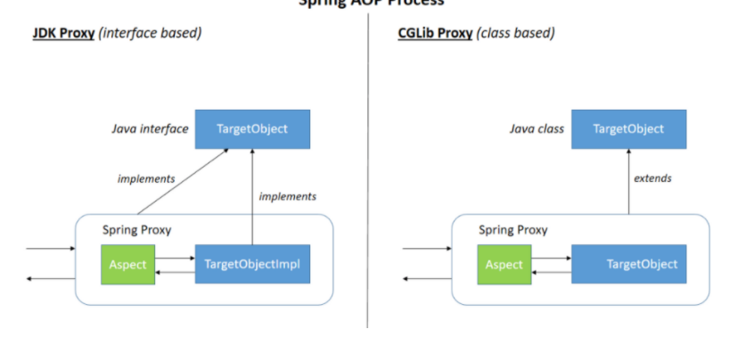

# Spring Boot AOP

# AOP

- 관점지향 프로그래밍 =⇒ "기능을 핵심 비즈니스 기능과 공통 기능으로 구분하여 모든 비즈니스 로직에 들어가는 공통 기능의 코드를 개발자의 코드 밖에서 필요한 시점에 적용하는 프로그래밍 방식"
- 로깅, 예외, 트랜잭션 처리 등
- 프록시 패턴으로 Controller가 타겟 메소드에 대한 접근을 컨트롤

## AOP 용어

- JoinPoint
  - 클라이언트가 호출하는 모든 비즈니스 메소드, 조인포인트 중에서 포인트 컷이 되기 떄문에 포인트 컷의 후보라고 할 수 있다.
- Point Cut
  - 특정 조건에 의해 필터링 된 조인 포인트, 수많은 조인 포인트 중에서 특정 메소드에서만 공통 기능을 수행하기 위해 사용된다.
- Advice
  - 공통 기능의 코드, 독립된 클래스의 메소드로 작성한다.
  - 어드바이스 동작 시점
  -
- Weaving
  - 포인트 컷으로 지정한 핵심 비즈니스 로직을 가진 메소드가 호출될 때, 어드바이스에 해당하는 공통 기능의 메소드가 삽입되는 과정
  - 위빙을 통해 공통 기능과 핵심 기능을 가진 새로운 프록시를 생성한다.
- Aspect
  - 포인트 컷과 어드바이스의 결합.
  - 어떤 포인트컷 메소드에 대해 어떤 어드바이스 메소드를 실행할 지 결정한다.

## AOP 동작 원리

- 프록시를 이용하여 AOP를 구현한다.
- 프록시는 타겟을 감싸서 타겟의 요청을 대신 받아주는 랩핑 오브젝트
- 호출자에서 타겟을 호출하게 되면, 타겟을 감싸고 있는 프록시가 호출된다.
  - 그렇기 때문에 메소드 실행 전 선처리, 후처리 등이 가능하다.
- 스프링 AOP에서 런타임 시 Weaving을 통해 프록시 객체를 생성하게 된다.
- 생성 방식으로는 JDK Dynamic Proxy가 있다.
  - 타겟 대상의 Interface 구현하여 프록시 객체 생성
  - 타겟 대상이 인터페이스를 구현하지 않았다면 aop 적용 불가
- ## CGLIB

# @Transaction

[https://velog.io/@pond1029/transactional](https://velog.io/@pond1029/transactional)

[https://hwannny.tistory.com/98](https://hwannny.tistory.com/98)

## @Transaction 동작 원리

- Transaction은 Spring AOP를 기반으로 동작한다.
- Spring AOP는 프록시 객체를 통해 기능을 수행한다.
- 이상이 없는 경우 Commit을, 예외가 발생하면 Rollback을 수행한다.

- 인터페이스를 구현한 객체는 Dynamic Proxy 방식
  - Dynamic Proxy란 리플렉션 방식으로 프록시 객체를 구현하는 것.
  - 대상 객체의 인터페이스를 구현한 프록시 객체를 사용한다.
  - 대상 객체의 인터페이스 구현 ⇒ 트랜잭션 + 타겟 메소드 선언하는 프록시 객체 선언
  - Controller는 타겟 메소드 호출하는 것으로 생각하지만, 실제로는 프록시의 메소드 호출
  - Dynamic이란 단어가 붙는 이유는 개발자 대신 런타임 시점에서 동적으로 만들어주기 때문이다.
  - Java의 리플랙션 패키지에 존재하는 Proxy 클래스를 통해 동적으로 다이나믹 프록시 객체를 생성한다.
- 그렇지 않은 경우에는 CGLib 방식을 사용

  - 클래스의 바이트 코드를 조작하여 프록시 객체를 만들어주는 라이브러리
  - Extends 방식으로 프록시 객체를 사용한다.
  - CGLib 방식은 Dynamic 방식보다 성능이 좋지만, 몇 가지 문제 때문에 SpringBoot 에서 잘 사용하지는 않는다.
  - CGLib 방식은 런타임 시 Dynamic과 다른 방식으로 사용하기 때문에 인터페이스가 없으면 다이나믹 프록시 객체를 **생성하지 못한다.**

- Spring Boot는 기본적으로 Dynamic Proxy 방식을 사용한다.

- 트랜잭션 기능이 담긴 어드바이스는 이미 등록되어 있다.
- Transactional을 타깃에 명시하면, 포인트컷 정보로 등록된다.
- 이 어드바이스와 포인트컷을 가지는 어드바이저는 Bean으로 등록된다.

## Transactional 사용시 주의점

- priavte 메소드 사용 불가
  - 인터페이스를 상속 받아 프록시 객체를 생성하기 때문에 상속 받을 수 없는 private 메소드는 트랜잭션 관리가 불가능하다.
- 내부의 메소드 호출 시 트랜잭션 관리가 되지 않는다.
  - 트랜잭션이 아닌 메소드에서 트랜잭션 선언된 내부 메소드 호출 시 프록시 객체가 아닌 일반 객체 메소드를 호출하기 때문에 트랜잭션 적용이 되지 않는다.

[https://n1tjrgns.tistory.com/266](https://n1tjrgns.tistory.com/266)

[https://lng1982.tistory.com/287](https://lng1982.tistory.com/287)

## Transactional Propagation

1. Propagation.REQUIRED
   1. default 값
   2. 부모 트랜잭션 내에서 실행하며, 부모 트랜잭션이 없는 경우 새로운 트랜잭션을 생성한다.
   3. 해당 메소드를 호출한 곳에서 별도의 트랜잭션이 설정되어 있지 않다면 트랜잭션을 새로 시작한다.
   4. 이미 트랜잭션이 설정되어 있다면, 기존의 트랜잭션 내에서 로직을 실행한다.
   5. 예외 발생 시 롤백이 되고, 호출한 곳에서도 롤백이 전파된다.
2. Propagation.REQUIRES_NEW
   1. 매번 새로운 트랜잭션을 시작한다.
   2. 호출한 곳에서 이미 트랜잭션이 설정되어 있다면(기존 연결이 존재) 기존 트랜잭션은 메소드가 종료될 때까지 잠시 대기 상태로 두고 자신의 트랜잭션 실행
   3. 새로운 트랜잭션 안에서 예외 발생해도, 호출한 곳에서 롤백이 전파되지 않는다.
3. Propagation.NESTED
   1. 부모 트랜잭션에서 진행될 경우 별개로 커밋되거나 롤백될 수 있다.
   2. 부모 트랜잭션이 없는 경우 Propagation.REQUIRED 와 동일하다.
   3. 차이점은 SAVEPOINT를 지정한 시점까지 부분 롤백이 가능하다는 것이다.(DB가 SAVEPOINT 기능을 지원하는 경우)
   4. 이미 진행중인 트랜잭션이 있는 경우 중첩 트랜잭션을 시작한다.
4. Propagation.MANDATORY
   1. 부모 트랜잭션 내에서 실행되며, 부모 트랜잭션이 없는 경우 Exception 발생
5. Propagation.SUPPORT
   1. 부모 트랜잭션이 존재하면 부모 트랜잭션으로 동작하고, 없을 경우 non-transactional 하게 동작한다.
6. Propagation.NOT_SUPPORT
   1. non-transactional 로 실행되며 부모 트랜잭션이 존재하면 일시 정지한다.
7. Propagation.NEVER

   1. non-transactional 로 실행되며 부모 트랜잭션이 존재하면 Exception이 발생한다.

   no-rollback-for : 롤백하지 않을 익셉션 타입

   rollback-for : 롤백할 익셉션 타입

## Transactional Isolation(격리 수준)

- 일관성이 없는 데이터를 허용하는 수준
- 격리 수준에는 4가지가 존재한다.
- 격리 수준이 높아질수록 동시성은 높이지고, 속도는 느려진다.

1. READ_UNCOMMITED (커밋되지 않는 읽기, level 0)
   1. 트랜잭션 처리 중 or 아직 commit 되지 않은 데이터를 다른 트랜잭션이 읽는 것을 허용
   2. Dirty Read 발생
2. READ_COMMITED (커밋된 읽기, level 1)
   1. dirty read 방지 : 트랜잭션이 commit 되어 확정된 데이터만 읽도록 허용
3. REPEATABLE_READ (반복 가능한 읽기, level 2)
   1. 트랜잭션 완료될 때까지 SELECT 문장이 사용되는 모든 데이터에 shared lock이 걸리기 때문에 다른 사용자는 해당 영역에 대한 데이터 수정이 불가능하다.
   2. 선행 트랜잭션이 읽는 데이터는 트랜잭션이 종료될 때까지 후행 트랜잭션이 갱신하거나 삭제하는 것을 불허함으로써 데이터를 두 번 쿼리했을 때 일관성 있는 결과를 리턴한다.
4. SERIALIZABLE (직렬화 가능, level 3)

   1. 완벽한 읽기 일관성 모드 제공
   2. 성능 측면에서 동시 처리성능이 가장 낮다.
   3. 거의 사용되지 않는다.
   4. 데이터의 일관성 및 동시성을 위해

   - `MVCC`(Multi Version Concurrency Control)를 사용하지 않음
   - 트랜잭션이 완료될 때까지 SELECT 문장이 사용하는 모든 데이터에 `shared lock`이 걸리므로 다른 사용자는 그 영역에 해당하는 데이터에 대한 수정 및 입력이 불가능하다.

   MVCC

   다중 사용자 DB 성능을 위한 기술

   데이터 조회시 LOCK을 사용하지 않고, 데이터의 버전을 관리해 데이터의 일관성 및 동시성을 높이는 기술
