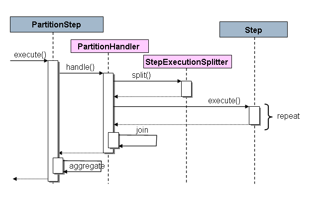

# Spring Batch Multi Thread

## Multi-threaded Step

- 스프링 배치에서 병렬 처리를 하기 위해 사용하는 가장 쉬운 방법은 TaskExecutor를 추가하는 것이다.

- 스프링에서는 TaskExecutor 구현체인 SimpleAsyncTaskExecutor를 제공한다.

- TaskExecutor를 추가하면, Step에서 멀티 스레드를 이용하여 read, process, write를 chunk 단위로 처리한다.

- 이 과정에서, 처리하는 `아이템 순서`는 `고정되어있지 않다`
  => 즉, 단일 스레드와 달리 일정한 순서로 데이터가 처리되는 것이 아니다.

- throttlelimit을 설정하여 스레드 풀에서 사용하는 스레드 개수를 조절할 수 있다.

```java
@Bean
public TaskExecutor taskExecutor(){
    return new SimpleAsyncTaskExecutor("Spring_Batch_TaskExecutor");
}

@Bean
public Step sampleStep(TaskExecutor taskExecutor) {
	return this.stepBuilderFactory.get("sampleStep")
				.<String, String>chunk(10)
				.reader(itemReader())
				.writer(itemWriter())
				.taskExecutor(taskExecutor)
				.throttleLimit(20)
				.build();
}

```

- 멀티 스레드 처리를 하면서 주의할 점이 존재한다.
  - Step의 readeer와 writer의 객체에 상태가 저장되어 있다면, 멀티 스레드에서 문제가 생길 수 있다.
  - 상태가 존재하지 않거나, thread safe한 reader와 writer를 사용하면, 문제를 방지할 수 있다.
  - JpaPagingReader 같은 경우 thread safe한 reader이고, 그렇지 않은 경우 SynchronizedItemStreamReader로 감싸서 동기화할 수 있도록 만들어주어야 한다.

## Parallel Steps

- 로직을 여러 Step으로 나눌 경우 싱글 프로세스로도 병렬화를 할 수 있다.

- StepFlow를 이용하여 각 Flow를 병렬로 처리할 수 있다.

## Partitioning

- 각 Step을 Manager라고 하고, 이 매니저를 대신해 각각의 Step이 실행되는 것들을 Worker라고 한다.


- JobRepository의 메타 데이터가 Job을 실행할 때마다 각 워커를 한 번씩만 실행함을 보장한다.

- Partitioning을 하기 위해 Step의 구현체 PartitionStep을 구현해야 한다.
  - 이러한 PartinionStep안에는 두 가지 인터페이스를 구현한다.
  - PartitionHandler
  - StepExecutionSplitter



- grid-size 속성을 설정하여 하나의 step이 너무 많은 요청을 수행하지 않도록 설정할 수 있다.

### PartitionHandler

- Spring에서는 PartitionHandler 구현체인 TaskExecutorPartitionHandler를 제공한다.
- TaskExecutiorPartitionHandler는 I/O 처리가 많은 Step에 유용하다.

```java
@Bean
public Step step1Manager() {
    return stepBuilderFactory.get("step1.manager")
        .partitioner("step1", partitioner())
        .partitionHandler(partitionHandler())
        .build();
}

@Bean
public PartitionHandler partitionHandler() {
    TaskExecutorPartitionHandler retVal = new TaskExecutorPartitionHandler();
    retVal.setTaskExecutor(taskExecutor());
    retVal.setStep(step1());
    retVal.setGridSize(10);
    return retVal;
}
```

### Partitioner

- 다음 Step을 실행할 때 입력 파라미터로 사용될 실행 컨텍스트를 만든다.
- Partitioner 인터페이스는 partition 메소드 하나만 존재한다.
- partition 메소드가 리턴하는 Map은 키가 Step의 유니크한 이름이고 값이 ExectutionContext 입력 파라미터이다.
- Step의 이름은 고유한 값이 되어야 한다.
  - Spring에서는 이를 위해 Partitioner 구현체 SimplePartitioner를 제공한다.
  - SimplePartitioner는 Step이름과 숫자를 조합하여 유니크한 이름을 제공한다.
- PartitionNameProvider 인터페이스를 구현하면, 각 파티션의 이름을 구현할 수 있다.
