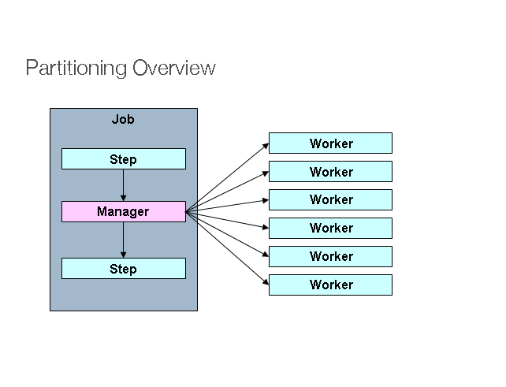
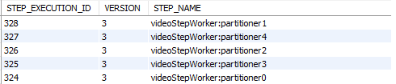
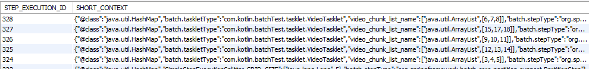

# Spring Batch Partitioner

## Spring Batch에서 Partitioner란?

스프링 배치에서는 멀티 스레드 관련된 여러 기능을 제공한다.

그 중 하나가 Partitioner이다.

하나의 Step을 여러 스레드가 동시에 진행하여 일을 처리한다.



위 그림과 같이, Manager역할을 하는 Step이 어떠한 일을 해야 하는지 정해준다.

그리고 각 Worker Step들은 부여 받은 역할을 진행한다.

각 Worker들은 독립적인 Step으로 구성된다.

그래서 Manager에서 역할을 부여할 때 Step_Execution_Context을 통해 값을 전달한다.

## Partitioner의 핵심

### PartitionHandler

Partitioner에서 PartitionHandler는 어떠한 Step을 병렬로 할 것인가, 스레드를 어떠한 방식으로 처리할 것인가를 지정한다.

### Partitioner

Partitioner를 상속 받아 구현한 클래스는 Manager Step이라고 생각하면 된다.

여기서 구현한 내용을 바탕으로 Worker가 생성된다.

## 상세 구현

### PartitionHandler

```kotlin
    @Bean
    fun partitionalHandler(): TaskExecutorPartitionHandler {
        val handler = TaskExecutorPartitionHandler()
        handler.step = videoStepWorker()
        handler.setTaskExecutor(executor())
        handler.gridSize = poolSize

        return handler
    }

    @Bean
    fun executor(): TaskExecutor {
        val executor = ThreadPoolTaskExecutor()
        executor.corePoolSize = poolSize;
        executor.maxPoolSize = poolSize;
        executor.setWaitForTasksToCompleteOnShutdown(true)
        executor.initialize()

        return executor
    }
```

TaskExecutorPartitionHandler의 step값을 설정하여 어떠한 step을 병렬로 처리할 지 결정한다.

TaskExecutorPartitionHandler의 setTaskExecutor 값을 설정하여 스레드를 어떠한 방식으로 처리할 지 결정한다.

### Partitioner

```kotlin

class VideotPartitioner(val min: Int, val max: Int,val workCnt: Int, val videoRepository: VideoRepository): Partitioner {

    override fun partition(gridSize: Int): MutableMap<String, ExecutionContext> {
        val result = mutableMapOf<String, ExecutionContext>()

        val videoList = videoRepository.findVideo(min, max, gridSize*workCnt)

        val workerVideoCnt = videoList.size/gridSize

        val videoChunk = videoList.chunked(workerVideoCnt)

        videoChunk.forEachIndexed{index, list ->
            val context = ExecutionContext()
            context.put(VideoTasklet.LIST_NAME, list)
            result["partitioner${index}"] = context
        }

        return result
    }
}


@Bean
fun videoStepManager(): Step {
    return stepBuilderFactory.get("video.step.manager")
        .partitioner("videoStepWorker", VideotPartitioner(3000, 88000, 3, videoRepository))
        .partitionHandler(partitionalHandler())
        .build()
}
```

Partitioner를 구현한 클래스는, Step을 구성할 때 partitioner 부분에 들어간다.

override한 partition메소드를 살펴보자.
partition메소드가 리턴하는 MutableMap<String, ExecutionContext>의 값을 바탕으로 Step이 구성된다.

MutableMap<String, ExecutionContext>의 key 값은 Worker Step의 이름이 되고, ExecutionContext는 Worker Step의 Step Context가 된다.

즉, Worker Step의 이름은 Manager Step 설정 시 partitioner에서 설정한 이름과 Partitioner 구현 클래스의 리턴 값의 Key 값으로 이루어진다.

[batch_step_execution]


[batch_step_execution_context]


### Tasklet

```kotlin
    @Bean
    fun videoStepWorker(): Step {
        return stepBuilderFactory.get("videoStepWorker")
            .tasklet(VideoTasklet)
            .build()
    }


    @Service
    class VideoTasklet: Tasklet {
        companion object{
            val LIST_NAME="video_chunk_list_name"
        }

        @Autowired
        lateinit var videoRepository: TestRepository

        override fun execute(contribution: StepContribution, chunkContext: ChunkContext): RepeatStatus? {

            val context = chunkContext.stepContext.stepExecutionContext

            val list = context[LIST_NAME] as List<Int>

            list.forEach {
                val video = videoRepository.findById(it).get()
                println("${Thread.currentThread().name}가 id ${it}을 작업하고 있습니다. ${video}")
            }

            return RepeatStatus.FINISHED
        }
    }

```

partitionalHandler에서 설정한 Worker Step을 살펴보자.

Worker Step은 Tasklet으로 구현했다.

이 Tasklet에서 매개변수로 받는 ChunkContext에서 현재 StepContext를 가져올 수 있고, StepContext에서는 StepExecutionContext를 가져올 수 있다.

StepExecutionContext에서는 Partitioner를 구현한 클래스에서 설정한 ExecutionContext을 가져온다.

즉, Manager Step에서 ExecutionContext에 각 Worker가 어떠한 일을 해야 하는지 저장하면, Worker는 ExecutionContext에서 자신이 해야 하는 일을 받을 수 있다는 것이다.
