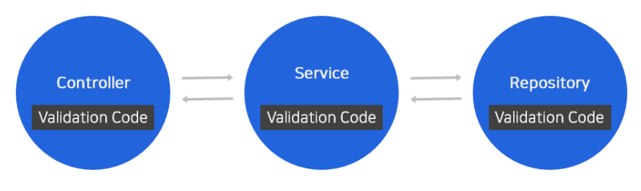

# Validation

# Validation 어디까지 해봤니?

[https://meetup.toast.com/posts/223](https://meetup.toast.com/posts/223)

## 문제

- 데이터 유효성 검사 로직의 문제점

  

  1. 애플리케이션 전체에 분산되어 있다.
  2. 코드 중복이 심하다.
  3. 비즈니스 로직에 섞여있어, 검사 로직 추적이 어렵고 애플리케이션이 복잡해진다.

## 해결 방법

- Java에서 Bean Validation이라는 데이터 유효성 검사 프레임워크를 제공한다.
- 위 문제들을 해결하기 위해 다양한 제약(Contraint)을 도메인 모델(Domain Model)에 어노테이션(Annotaion)으로 정의할 수 있게 한다.
- 유효성 검사가 필요한 객체에 직접 정의하는 방법으로 기존 유효성 검사 로직의 문제점을 해결한다.ㄴ

  

## 제약 검사 설정과 기능

- Validation Starter를 추가한다.
- Service나 Bean에서 사용하기 위해서는 @Validate와 @Valid를 추가해야 한다.
  - @Valid가 설정된 메소드가 호출될 때 유효성 검사를 진행한다.
  - Controller에서는 @Validated가 필요 없이 검사가 필요한 곳에 @Valid를 추가하면 된다.
- Bean Validation 에서는 @Length, @NotBlank, @NotNull 등을 이용하여 설정할 수 있다.

```java
public class CreateContact{
	@Length(max=64)
	@NotBlank
	private String uid;

	@NotNull
	private ContactType contactType;

	@Length(max=1_600)
	private String contact;

}
```

- 유효성 검사 진행 시 같은 데이터를 여러 번 실행하게 될 경우 애플리케이션 성능에 영향을 미칠 수 있기 때문에 주의해야 한다.

## 사용자 정의 제약(Custom Constraint)

- Bean Validation에서 제공하는 제약이 아닌, 필요한 제약을 직접 정의해서 사용할 수 있다.

```java
@Target({METHOD, FIELD, ANNOTATION_TYPE, CONSTRUCTOR, PARAMETER, TYPE_USE})
@Retention(RUNTIME)
@Constraint(validatedBy = NoEmojiValidator.class)
@Documented
public @interface NoEmoji{
    String message() default "Emoji is not allowed";

    Class<?>[] groups() default {};

    Class<? extends Payload>[] payload() default {};

    @Target({METHOD, FIELD, ANNOTATION_TYPE, CONSTRUCTOR, PARAMETER})
    @Retention(RUNTIME)
    @Documented
    @interface List{
        NoEmoji[] value();
    }
}
```

```java
public class NoEmojiValidator implements ConstraintValidator<NoEmoji, String> {
    @Override
    public boolean isValid(String value, ConstraintValidatorContext context) {
        if (StringUtils.isEmpty(value) == true) {
            return true;
        }

        return EmojiParser.parseToAliases(value).equals(value);
    }
}
```

```java
public class CreateContact {

		// 커스텀 제약 추가
    @NoEmoji
    @Length(max = 64)
    @NotBlank
    private String uid;

    @NotNull
    private ContactType contactType;
    @Length(max = 1_600)
    private String contact;
}
```

# Custom Annotaion

[https://donghyeon.dev/spring/2020/08/18/Spring-Annotation의-원리와-Custom-Annotation-만들어보기/](https://donghyeon.dev/spring/2020/08/18/Spring-Annotation%EC%9D%98-%EC%9B%90%EB%A6%AC%EC%99%80-Custom-Annotation-%EB%A7%8C%EB%93%A4%EC%96%B4%EB%B3%B4%EA%B8%B0/)

## java.lang.annotaion

- 어노테이션 작성 시 사용하는 java.lang.annotation 패키지에는 4가지 기능이 존재한다.

1. @Documented : java doc에 문서화 여부를 결정한다.
2. @Retention : 어노테이션의 지속 시간을 결정한다.

   

   1. RetentionPolicy.SOURCE : 컴파일 후 정보들이 사라진다. @Override, @SuppressWarnings 등이 있따.
   2. RetentionPolicy.CLASS : default 값. 컴파일 타임 까지만 사용되기 때문에 .class 파일은 존재하지만, 런타임시 없어진다. Reflection 사용이 불가능하다.
   3. RetentionPolicy.RUNTIME : 런타임시 까지 존재한다. 커스텀 어노테이션 만들 때 주로 사용한다. Reflection 사용이 가능하다.

3. @Target : 어노테이션을 작성할 곳. **default는 모든 대상이다.**

   1. @Target(ElementType.FIELD) 지정 시 필드에만 어노테이션을 달 수 있다.

      ElementType.TYPE (class, interface, enum)

      ElementType.FIELD (instance variable)

      ElementType.METHOD

      ElementType.PARAMETER

      ElementType.CONSTRUCTOR

      ElementType.LOCAL_VARIABLE

      ElementType.ANNOTATION_TYPE (on another annotation)

      ElementType.PACKAGE (remember package-info.java)

4. @Inherited : 자식 클래스에 상속할 지 결정한다.

## Custom 어노테이션 만들기

1. @interface를 이용하여 어노테이션 타입을 정의해야 한다.
   - 모든 어노테이션은 자동으로 java.lang.Annotation 인터페이스를 상속하기 때문에 다른 클래스나 인터페이스를 상속 받으면 안된다.
2. 파라미터 멤버들의 접근자는 public 이거나 default 이어야 한다.
3. 파라미터 멤버들은 byte, short, int, float, double, boolean 의 기본 타입과 String, Enum, Class, 어노테이션만 사용할 수 있다.
4. 클래스 메소드와 필드에 관한 어노테이션 정보를 얻고 싶으면, 리플렉션을 이용하면 된다.

[https://cheese10yun.github.io/spring-custom-valdate-annotation/](https://cheese10yun.github.io/spring-custom-valdate-annotation/)

[https://bamdule.tistory.com/107](https://bamdule.tistory.com/107)

[https://shinsunyoung.tistory.com/89](https://shinsunyoung.tistory.com/89)

[https://devonce.tistory.com/42](https://devonce.tistory.com/42)

여러 필드 한번에 처리

- [https://stackoverflow.com/questions/40353638/spring-custom-annotation-validation-with-multiple-field](https://stackoverflow.com/questions/40353638/spring-custom-annotation-validation-with-multiple-field)

# 커스텀 어노테이션 이용하여 유효성 체크 정리

1. 커스텀 어노테이션 정의
2. ConstraintValidator를 구현한 클래스 선언
   1. ConstraintValidator<커스텀 어노테이션, 검증할 객체>
3. 해당 객체에 @Valid 붙여주기 & 해당 객체 안에서 검증할 필드에 커스텀 어노테이션 작성하기
