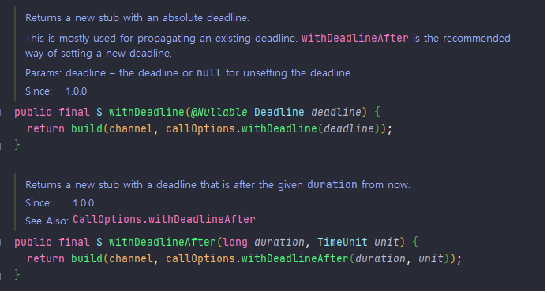

# gRPC - 고급기능

# 인터셉터

- 공통적인 로직을 실행할 때 사용한다.
- 인터셉터 인터페이스를 확장하여 로깅, 인증, 권한 부여, 메트릭, 추적 등에 유용하게 사용할 수 있다.
- 서버와 클라이언트 측 모두에서 사용할 수 있다.
- 인터셉트하는 RPC 호출 타입에 따라 두 가지 유형으로 분리된다.
  1. 단일 인터셉터(unary interceptor)
  2. 스트리밍 인터셉터(streaming interceptor)


### 단일 인터셉터

- 단일 인터셉터 구현은 전처리, RPC 메소드 호출, 후처리 부분으로 나눌 수 있다.
- 전처리 : RPC 컨텍스트, RPC 요청, 인자 검사 등 실행
- 후처리 : 반환된 응답과 에러에 대한 처리 등 실행

### 스트리밍 인터셉터

- gRPC 서버가 처리하는 모든 스트리밍 RPC 호출을 인터셉트할 수 있다.
- 스트리밍 인터셉터는 전처리 단계와 스트림 동작 인터셉터 단계를 포함한다.
- 스트림의 래퍼 구현을 통해 스트리밍 메시지를 가로챌 수 있다.

## 서버 측 인터셉터

- 클라이언트에서 gRPC 원격 메소드를 호출할 때 서버에서 인터셉터를 사용하여 메소드 실행 전 공통 로직을 실행할 수 있다.
- 인증과 같은 특정 기능을 적용해야 할 때 도움이 된다.
- gRPC 서버에 하나 이상의 인터셉터를 연결할 수 있다.

## 클라이언트 측 인터셉터

- 클라이언트 코드 외부에서 gRPC 서비스를 안전하게 호출하는 재사용 가능한 특정 기능을 구현해야 할 때 사용한다.

### 서버측 인터셉터 구현

1. ForwardingServerCallListener<ReqT>를 상속 받는 클래스를 생성하여 구현한다.
   - onMessage 메서드는 클라이언트의 메시지를 호출한다.

```
public class UserServerCallListener<ReqT> extends ForwardingServerCallListener<ReqT> {
    private final ServerCall.Listener<ReqT> delegate;
    UserServerCallListener(ServerCall.Listener<ReqT> delegate) {
        this.delegate = delegate;
    }
    @Override
    protected ServerCall.Listener<ReqT> delegate() {
        return delegate;
    }
    @Override
    public void onMessage(ReqT message) {
        System.out.println("[Server Call Listener] Client Message : " + message);
        super.onMessage(message);
    }
}
```

2. ServerCall<ReqT, RespT> 추상 클래스를 상속받는 클래스를 생성
   - sendMessage 메서드는 클라이언트에게 메시지를 전달할 때 호출된다.

```
public class UserServerCall<ReqT, RespT> extends ForwardingServerCall.SimpleForwardingServerCall<ReqT, RespT> {
    protected UserServerCall(ServerCall<ReqT, RespT> delegate) {
        super(delegate);
    }
    @Override
    protected ServerCall<ReqT, RespT> delegate() {
        return super.delegate();
    }
    @Override
    public MethodDescriptor<ReqT, RespT> getMethodDescriptor() {
        return super.getMethodDescriptor();
    }
    @Override
    public void sendMessage(RespT message) {
        System.out.println("[Server Call] Service Return Message : " + message);
        super.sendMessage(message);
    }
}
```

3. ServerInterceptor 인터페이스의 구현 클래스를 생성
   - incerceptCall 메서드를 통해 수신 메시지를 처리할 리스너를 직접 정의할 수 있다.

```
public class UserServerInterceptor implements ServerInterceptor {
    @Override
    public <ReqT, RespT> ServerCall.Listener<ReqT> interceptCall(ServerCall<ReqT, RespT> call, Metadata headers, ServerCallHandler<ReqT, RespT> next) {
        System.out.println("[Server Interceptor] : Invoke RPC - " + call.getMethodDescriptor().getFullMethodName());
        ServerCall<ReqT, RespT> serverCall = new UserServerCall<>(call);
        return new UserServerCallListener<>(next.startCall(serverCall, headers));
    }
}
```

| 참고 : https://tech.lattechiffon.com/2021/07/08/grpc-%EC%9D%B8%ED%84%B0%EC%85%89%ED%84%B0-%EA%B5%AC%ED%98%84-java/

<br>
<br>

# 데드라인

- 개별 RPC를 기준으로 타임아웃을 적용하는 것이 아니라, 요청 전체에 걸쳐 적용하는 것.
- 요청을 시작하는 애플리케이션이 데드라인을 설정하면, 전체 요청 체인은 데드라인까지 응답해야 한다.
- gRPC에서는 네트워크 지연이나 무한 대기 등의 이유로 데드라인 설정이 권장된다.
- 데드라인은 전체 호출 서비스에 적용된다.
- 클라이언트와 서버는 데드라인과 관련해 독립적이다.
  => RPC가 유효한지 항상 확인해야 한다.

## 데드라인 프로세스

1. 클라이언트는 gRPC 서비스에 처음 연결할 때 데드라인을 설정한다.
2. 클라이언트는 RPC 호출이 시작되면, 데드라인 기간 동안 기다린다.
3. 해당 기간 내 응답이 없으면 DEADLINE_EXCEEDED 에러와 함께 RPC 호출이 종료된다.

## 데드라인 값 설정 고려 요소

1. 호출하는 개별 서비스의 end-to-end 지연시간.
2. RPC가 직렬화 되는가?
3. 병렬로 호출될 수 있는가?
4. 기본 네트워크의 지연시간과 다운스트림 서비스의 데드라인 값 등

```java

OrderManagementGrpc.OrderManagementBlockingStub stub = OrderManagementGrpc.newBlockingStub(channel).withDeadlineAfter(1000, TimeUnit.MILLISECONDS);

try {
    // Add Order with a deadline
    StringValue result = stub.addOrder(order);
    logger.info("AddOrder Response -> : " + result.getValue());
} catch (StatusRuntimeException e) {
    if (e.getStatus().getCode() == Status.Code.DEADLINE_EXCEEDED) {
        logger.info("Deadline Exceeded. : " + e.getMessage());
    } else {
        logger.info("Unspecified error from the service -> " + e.getMessage());
    }
}

```



<br>
<br>

# 취소 처리

- 클라이언트나 서버에서 RPC를 중단시키려 할 때 RPC 취소를 할 수 있다.
- RPC가 취소되면, RPC 관련 메시징 처리는 불가능해지고, 상대방에 RPC가 취소되었다고 전파된다.
- 클라이언틑 gPRC 라이브러리는 클라이언트와 서버 애플리케이션 사이의 gRPC 종료를 나타내는 필수 gRPC 헤더를 생성한다.
- 취소된 컨텍스트에서 메시지를 읽으려 할 경우 에러가 발생한다.
- 에러를 처리하는 과정에서 취소가 되었는지 확인할 수 있다.

<br>
<br>

# 에러 처리

- 에러 발생 시 gRPC는 에러 상태의 자세한 정보를 제공하는 에러 메시지와 상태 코드를 반환한다.
- java에서는 enum으로 정의되어 있다.

| 코드             | 숫자 | 설명                                      |
| ---------------- | ---- | ----------------------------------------- |
| OK               | 0    | 성공 상태                                 |
| CANCELLED        | 1    | 처리가 취소됨(호출자에 의해)              |
| UNKOWN           | 2    | 알 수 없는 에러                           |
| INVALID_ARGUMENT | 3    | 클라이언트에 의해 유효하지 않은 인수 지정 |
| DEADLINE_EXCEED  | 4    | 처리 완료 전 데드라인 만료                |

- https://grpc.github.io/grpc-java/javadoc/io/grpc/Status.Code.html
- gRPC 에러 상태와 세부 사항은 전송 프로토콜 레벨에서 트레일러 헤더를 통해 전송된다.

<br>
<br>

# 멀티플렉싱

- gRPC를 이용하여 동일한 gPRC 서버에서 여러 gRPC 서비스를 실행할 수 있다.
- 여러 gRPC 클라이언트 스텁에 동일한 gRPC 클라이언트 연결을 사용할 수 있다.
- 멀티플렉싱을 이용하여 한 서버에 동일한 서비스의 여러 버전을 호스팅하여 레거시 클라이언트를 수용할 수 있다.
- 마이크로 서비스와 같은 사례에서는 서비스간 동일한 서버 gRPC 인스턴스를 공유하지 않는다.


<br>
<br>

# 메타데이터

- gRPC 메타데이터를 이용하여 비즈니스 콘텍스트와 관련 없는 정보를 공유할 수 있다.
- 메타데이터는 key/value 형식으로 구성된다.
- 메타데이터 value를 바이너리 형식으로 전송한다면, 전송 시에 base64로 인코딩/디코딩 된다.

```java
Metadata metadata = new Metadata();

Map<String, String> attachments = request.getAttachments();
    if (attachments != null && !attachments.isEmpty()) {
      for (Entry<String, String> entry : attachments.entrySet()) {
        metadata.put(Metadata.Key.of(entry.getKey(), Metadata.ASCII_STRING_MARSHALLER), entry.getValue());
      }
    }


String ret_MD = metadata.get(Metadata.Key.of("MY_MD_1", ASCII_STRING_MARSHALLER));

```

<br>
<br>

# 네임리졸버

- 서비스 이름에 대한 백엔드 IP 목록을 반환한다.
- 로드밸런싱을 할 때 사용한다.

<br>
<br>

# 로드벨런싱

- 서비스들 사이에 RPC 호출을 분산시킨다.
- gRPC 로드벨런싱 매커니즘
  1. 로드밸런서 프록시(load-balancer proxy, LB proxy)
  2. 클라이언트 측 로드밸런싱(client-side load balancing)

## 로드밸런서 프록시

- 클라이언트는 LB 프록시에게 RPC 요청하면, LB 프록시는 실제 로직 처리를 하는 gRPC 서버 중 하나에게 RPC호출 분배한다.
- 서버의 토폴리지는 클라이언트에게 공개되지 않으며, 클라이언트는 로드밸런서의 엔드포인트만 알고 있다.
  => 클라이언트는 로드밸런싱 사용 사례에 맞게 변경될 필요가 없다.
- 서버는 로드 상태를 로드밸런서에게 다시 알릴 수 있다.
- gRPC는 HTTP/2를 지원하기 때문에 HTTP/2를 지원하는 로드밸런서를 선택해야 한다.


<br>
<br>

## 클라이언트 측 로드밸런싱

- 로드밸런서를 갖는 대신, 클라이언트 측에서 로드밸런싱 로직을 구현할 수 있다.
- 로드밸런싱 로직은 클라이언트 어플리케이션의 일부나, 전용 서버(lookaside 로드밸런서)에서 구현될 수 있다.
- 클라이언트는 질의를 통해 연결할 gRPC 서버를 얻어 연결한다.


<br>
<br>

# 압축

- 네트워크 대역폭을 효율적으로 사용하기 위해 압축을 사용할 수 있다.
- 클라이언트에서 압축을 구현하여 전송하면, 서버에서는 등록된 압축기가 자동으로 요청 메시지를 디코딩한다.
- 서버에 등록되지 않은 압축 방식인 경우 Unimplemented 상태가 클라이언트로 반환된다.

```java
StringValue result = stub.withCompression("gzip").addOrder(order);
```


