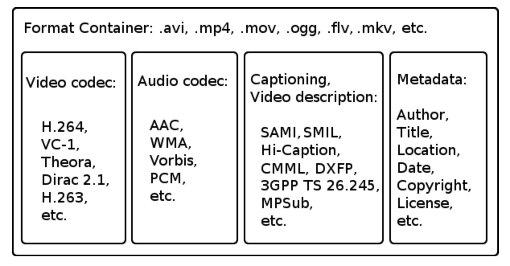

# 코덱

# 코덱

[https://namu.wiki/w/코덱](https://namu.wiki/w/%EC%BD%94%EB%8D%B1)

[https://shana.pe.kr/shanaencoder_tip/80458](https://shana.pe.kr/shanaencoder_tip/80458)

[https://bradbury.tistory.com/211](https://bradbury.tistory.com/211)

[https://bradbury.tistory.com/212?category=941375](https://bradbury.tistory.com/212?category=941375)

## 코덱이란?

CODEC = COder + DECoder

- 코더(coder) : 아날로그 신호(음성 또는 영상의 신호)를 디지털 신호로 변환
- 디코더(decoder) : 디지털 신호를 아날로그 신호로 변경시켜주는 것.

같은 영상이라도 코덱의 차이에 따라 재구성된 화질이 달라진다.

## 용어

### 비트레이트(bit per second, BPS)

- 1초간 송수신할 수 있는 비트 수 ⇒ 초당 처리할 수 있는 용량
- 비트레이트가 높을수록 화질이 좋아지지만, 파일 용량이 높아진다.
  - 동영상의 용량 = 비트레이트 X 재생 시간
- CPU에 부하가 걸릴 수 있다.
- 네트워크 속도(QoS)에 따라 버퍼링이 걸릴 수 있다.

### 프레임레이트(FPS)

- 1초에 보여지는 영상 프레임
- 30fps = 1초당 30프레임이 보여진다.
- 같은 비트레이트라면 fps가 높을 수록 한 프레임에 자원이 더 배분되어 화질이 떨어질 수 있다.
  - 비트레이트/프레임레이트 = 한 프레임 당 사용할 수 있는 데이터 수
  - 즉, 비트레이트가 똑같고, fps가 높아지면 한 프레임에 표현할 수 있는 데이터가 작아진다.

### 키프레임

- 일정 시간당 저장되는 일종의 스틸컷 화면
- 모든 이미지를 저장하는 것이 아니라, 변화되는 부분만 저장한다.
- 즉, 키프레임 간격이 너무 길면 이미지를 계산해 내느라 딜레이가 걸린다.
- 같은 비트레이트라면 키프레임이 많을수록 키프레임 계산에 자원이 더 분배되어 화질이 떨어질 수 있다.

## 컨테이너

### 컨테이너

- 코덱으로 압축된 미디어 + 코덱 이름, 아티스트, 날짜 등의 메타데이터
- 컨테이너에는 코덱에 의해 압축(인코딩)된 미디어, 오디오 스트림 + 스트림을 제어할 수 있는 다양한 정보를 가지고 있다.
  
- 컨테이너에 스트림을 담는 과정 ⇒ 멀티 플랙싱(Multiplexing), 먹싱(Muxing)
- 같은 컨테이너라도, 안에 들어 있는 스트림은 다른 코텍으로 저장할 수 있다.
  - MP4 컨테이너 : H.264, DivX 등
  - 같은 컨테이너라도, 어떤 코덱으로 인코딩을 했느냐에 따라 플레이어에서 실행 가능할 수도, 아닐 수도 있다.
  - 즉, H.264로 인코딩된 MP4 컨테이너 파일 A와 DivX로 인코딩한 B가 있을 때. 플레이어가 H.264 코덱만 있다면, B는 재생이 불가능하다.

### 동영상 컨테이너 종류와 특징

- MP4(.mp4, m4v)
  - MPEG-4
  - MPEG에서 개발한 멀티미디어 표준 포맷.
  - 일반적으로 가장 많이 사용된다.
  - 높은 압축률의 H.264 코덱을 주로 사용한다.
- AVI(.avi)
  - Audio Video Interleave
  - 마이크로 소프트에서 개발한 윈도우 표준 동영상 포맷
  - 다양한 종류의 코덱을 지원하여 여러 환경에서 재생할 수 있다.
- WMV(.wmv, .mwa, .asf)
  - Windows Media Video, Advanced Systems Format
  - AVI의 단점을 보완하고자 MS에서 개발한 컨테이너
  - DRM, 메타 정보, 스트리밍과 같은 추가 정보를 제공한다.
  - 높은 압축률로 파일 용량을 작게 만들기 때문에 실시간으로 감상하는 스트리밍에 적합하다.
  - 리눅스나 맥에서 호환성 문제가 자주 발생할 수 있다.
- MPEG-PS(.mpg, .mpeg), MPEG-TS(.ts)
  - MPEG Program stream, MPEG Transport Stream
  - MPEG-1/2 영상을 효율적으로 전송하기 위해 설계된 컨테이너이자 통신 프로토콜
  - 디지털 방송에서 많이 사용되는 포맷으로 TS는 전송, PS는 저장에 목적이 있다.
  - 가장 원본에 가까운 고화질의 영상을 볼 수 있다.
  - 패킷 단위로 재생되기 때문에 압축이 되지 않아 용량이 크다
- MKV(.mkv)
  - Matroska Multimedia Container
  - 오픈 소스가 개발되었으며, 비디오, 오디오, 그림, 자막을 한 파일안에 담을 수 있는 형식
  - 영화/드라마 등의 멀티미디어 콘텐츠를 담기 위한 보편적인 포맷으로 개발
  - 코덱 종류에 상관 없이 모든 스트림을 담을 수 있다.
  - 지원하지 않는 환경이 꽤 있다.
- MOV(.mov)
  - QuickTime
  - Apple에서 개발한 멀티미디어 컨테이너로 MPEG-4 Part 14(H.264 / AVC)코덱을 사용한다.
  - 실시간 스트리밍을 지원하며 VR 기능도 지원
  - 윈도우 진영에서는 별도의 플러그인을 설치해야될 수 있다.
- WebM(.webm)
  - 구글이 개발한 오픈소스 미디어 컨테이너 포맷.
  - Web에 최적화된 미디어 포맷으로 HTML5에서 기본적으로 지원하여 태그를 이용해 온라인 재생을 지원한다.
  - VP8, VP9, AV1을 지원하고 오디오 코덱은 Vorbis, Opus를 지원한다.
  - H.264를 사용하는 컨테이너와 비교해 스트리밍 환경에서 더 안정적이다.
  - H.264를 사용하는 컨테이너와 비교해 압축률과 인코딩 효율이 떨어진다.

확장자

- 텍스트의 꼬리표, 수정해도 파일의 본질이 바뀌는 것은 아니다.

I-Frame(Intra Frame)

- 압축 및 해제를 위해 다른 프레임들을 참조하지 않는 독자적인 프레임
- 키프레임이라고 불린다.
- GOP의 기준이 되는 핵심 프레임
- GOP의 첫 프레임은 반드시 I-Frame으로 시작한다.
- 원본 그대로 저장된 프레임

P-Frame(Predicted Frame)

- 순방향 예측 프레임
- 바로 이전의 I-Frame을 기준으로 차이가 나는 부분만 예측하여 저장한 프레임
- I-Frame에 비해 용량이 33%이다.

B-Frame(Bidirectional Frame)

- 양방향 예측 프레임
- I-Frame과 P-Frame 사이에 껴서 양쪽 프레임을 모두 참조하여 두 프레임 사이 데이터를 추측하여 저장하는 프레임
- P-Frame에 비해 용량이 33%이다.

