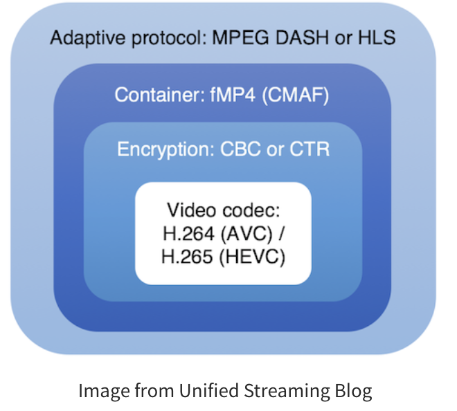

# DRM

[https://pallycon.tistory.com/entry/넷플릭스는-어떻게-콘텐츠를-보호하는가-제1부](https://pallycon.tistory.com/entry/%EB%84%B7%ED%94%8C%EB%A6%AD%EC%8A%A4%EB%8A%94-%EC%96%B4%EB%96%BB%EA%B2%8C-%EC%BD%98%ED%85%90%EC%B8%A0%EB%A5%BC-%EB%B3%B4%ED%98%B8%ED%95%98%EB%8A%94%EA%B0%80-%EC%A0%9C1%EB%B6%80)

[https://pallycon.tistory.com/entry/넷플릭스는-어떻게-콘텐츠를-보호하는가-제2부](https://pallycon.tistory.com/entry/%EB%84%B7%ED%94%8C%EB%A6%AD%EC%8A%A4%EB%8A%94-%EC%96%B4%EB%96%BB%EA%B2%8C-%EC%BD%98%ED%85%90%EC%B8%A0%EB%A5%BC-%EB%B3%B4%ED%98%B8%ED%95%98%EB%8A%94%EA%B0%80-%EC%A0%9C2%EB%B6%80)

[https://pallycon.com/ko/blog/category/content-security/multi-drm/](https://pallycon.com/ko/blog/category/content-security/multi-drm/)

## DRM이란?

- Digital Rights Management(디지털 권리 관리)
- 저작권자가 그들이 배포한 디지털 자료의 사용을 제어하고, 이를 의도한 용도로만 사용하도록 제한하는 기술을 지칭하는 용어
- 디지털 컨텐츠를 인증된 사용자가 인증된 기간 동안만 사용 가능하도록 하여 불법적인 사용을 방지하는 것.

## DRM의 발전

- 과거 - 싱글 DRM과 플러그인
  - 과거에는 특정 DRM 업체가 제공하는 단일 DRM 솔루션을 적용해 콘텐츠를 보호했다.
  - 싱글 DRM은 모두 플러그인 방식 브라우저 지원이라는 공통 문제점을 안고 있었다.
  - 각종 보안 이슈와 성능 등의 문제로 웹 브라우저 플러그인 지원이 중단되어 플러그인 방식 DRM은 사라져가고 있다.
- 현재 - 멀티 DRM, 플러그인 방식에서의 해방
  - HTML5 표준에는 플러그인 문제를 해결하기 위한 여러 규격들이 추가되었다.
  - 인크립트 미디어 익스텐션(Encrypted Media Extention, EME) 규격은 웹 브라우저 상에서 실행되는 HTML/Javascript 기반 웹 애플리케이션이 DRM과 상호 작용할 수 있도록 API를 제공한다.
  - 미디어 소스 익스텐션(Media Source Extension, MSE) 규격을 통해서도 DRM 콘테츠의 재생이 웹 브라우저 자체적으로 재생할 수 있도록 지원해준다.
- 미래 - CMAF을 통한 멀티 DRM의 콘텐츠 단일화
  - 원본 콘텐츠를 두 가지 이상의 서로 다른 스트리밍 포맷으로 준비해야 하는 불편함이 존재하게 되었다.
  - 이 문제를 해결하기 위해 단일 콘텐츠로 모든 브라우저와 플랫폼을 지원하는 CMAF(Common Media Application Format) 규격이 발표되었다.
    
  - CMAF 단일 콘텐츠가 현실화 되기 위해서는 각 DRM과 플랫폼에서의 지원이 필요하다.

## DRM 동작 방식

- 암호화 키 관리 및 전달
  1. 암호화 패키징
     - 패키저는 콘텐츠 암호화를 위해 DRM 서버 시스템에 암호화 키를 요청한다.
     - 생성된 암호화 키는 콘텐츠 ID에 연결된다.
     - 패키저는 해당 키를 이용하여 콘텐츠를 암호화하여 패키징한다.
  2. 콘텐츠 복호화
     - 정상적인 사용자가 DRM 콘텐츠를 재생하면, 클라이언트 플레이어는 해당 콘텐츠의 ID에 링크된 암호 해독키를 DRM 서버에 요청한다.
     - 플레이어는 DRM 서버에서 안전하게 전달된 키를 이용해 콘텐츠를 복호화하여 재생한다.
- 추가적인 보안
  - 라이선스 토큰
    - 토큰을 이용하여 콘텐츠 키 요청의 무관성과 일관성을 검증한다.
    - 클라이언트가 DRM 서버에 콘텐츠 키를 요청할 때, 라이선스 토큰을 통해 요청의 유효성을 검사할 수 있다.
    - URL 공유 및 변조를 방지하는데 도움이 된다.
  - HTTPS
    - 서버와 클라이언트간 메타 데이터와 함께 트래픽까지 암호화되어 전체 스트리밍 세션을 기밀로 보호한다.

## DRM 패키징

- 사전 패키징(Pre-Packaging) 방식
  - 클라이언트가 콘텐츠를 요청하기 전에 미리 암호화된 콘텐츠 사본을 준비한다.
  - 클라이언트 요청에 따라 암호화된 해당 콘텐츠를 전송한다.
  - 다양한 콘텐츠를 모두 여러 형식으로 암호화해야 하므로 스토리지 공간이 많이 필요하다는 단점이 존재한다.
  - 스트리밍 형식 외에도 다양한 비트 전송률과 해상도로 여러 콘텐츠 사본이 필요하게 된다.
- 실시간 패키징 방식
  - 사전 패키징의 콘텐츠 중복 문제를 해결할 수 있다.
  - 많은 DRM 솔루션들은 실시간 콘텐츠 패키징을 지원한다.
  - 스토리지에 원본이 MP4 형태로 저장되어 있고, 사용자의 재생 요청 시 특정 형식으로 패키징하여 전달한다.
  - 클라이언트가 특정 콘텐츠 요청 시 스트리밍 시스템은 해당 클라이언트에 적합한 DRM 및 스트리밍 형식을 판단한다.
  - 요청에 따라 원본 콘텐츠를 실시간 암호화하여 패키징한다.
  - 패키징 과정에서 DRM 암호화를 적용할 수 있다.

## 멀티 DRM

- 크롬, 사파리, IE/엣지 등 각 브라우저마다 서로 다른 DRM을 제공하는 것.
- 마이크로소프트의 IE/엣지 브라우저는 MS의 PlayReady DRM만 지원한다.
- 구글 크롬은 구글의 DRM인 Widevine Modular DRM을 지원한다.
- 애플의 사파리는 FairPlay Streaming DRM을 지원한다.
- ⇒ 윈도우, 맥 OS 등 다양한 환경의 PC 사용자들에게 편리한 서비스를 제공하기 위해 위 3가지 DRM을 콘텐츠에 적용해야 한다.
- 브라우저 뿐만 아니라, 스마트폰, 태블릿, 스마트 TV 등 멀티 DRM을 지원하는 다양한 모바일 및 OTT 클라이언트 기기에서도 사용될 수 있다.

## DRM 스트리밍 방식

- 각 DRM에서 지원하는 스트리밍 방식에도 차이가 존재한다.
- PlayReady와 Widevine은 MPEG-DASH, FairPlay DRM은 HLS(HTTP Live Streaming) 방식을 지원한다.
- 플랫폼, 브라우저 별 지원 DRM과 콘텐츠 형식

  

## DRM 콘텐츠의 재생 과정

## DRM 라이선스 연동 방식

- DRM 라이선스 서버가 클라이언트 기기로부터의 라이선스 요청을 처리하면, 우선 해당 사용자가 콘텐츠 사용 권한이 있는지 확인해야 한다.
- 대부분의 DRM 솔루션/서비스는 두 가지 방식으로 콘텐츠 서비스의 시스템과 연동한다.
  - 라이선스 토큰
  - 콜백 URL

라이선스 토큰을 이용한 연동

- 토큰 방식 DRM 라이선스 연동 과정
  
- 장점 : 콘텐츠 서비스 시스템과 DRM 서버 사이의 통신이 필요 없기 때문에 콘텐츠 재생 시작에 걸리는 지연 시간을 줄일 수 있다.
- 단점 : 토큰을 생성하고 안전하게 클라이언트에 전달하는 기능을 콘텐츠 서비스 사이트가 직접 구현해야 한다는 점에서 더 많은 리소스가 필요하다.
- 단시간에 많은 요청이 몰리거나 글로벌을 대상으로 하는 서비스의 경우, 라이선스 발급 처리 성능을 최대화하고 지연 시간을 최소화 하기 위한 토큰 방식의 라이선스를 권장한다.

콜백 URL을 통한 연동

- DRM 라이선스 서버가 콘텐츠 서비스의 시스템과 HTTP URL 통신을 통해 사용자 콘텐츠 사용 권한을 확인하는 방식
  
- 장점 : 초기 연동 과정에서 토큰 방식 대비 비교적 쉽게 테스트를 수행할 수 있고, 토큰 데이터의 안전한 관리에 대한 부담을 덜 수 있다.
- 단점 : 시스템 간 통신에 따른 재생 시작 지연이 토큰 방식에 비해 길어질 수 있다. 이에 따라 단시간에 대규모 요청 시 동시 처리가 불가능하다.

## 클라이언트 유형에 따른 멀티 DRM 콘텐츠 재생

HTML5 웹 플레이어 연동

- HTML5의 EME(Encrpyted Media Extention) 표준을 지원하는 웹 브라우저에서는 각 OS와 브라우저 별로 제공되는 CDM(Content Decryption Module)을 통해 DRM 콘텐츠 재생 가능
- Shaka Player, VideoJS 등의 오픈 소스 플레이어나 Bitmovin, THEOplayer 등 상용 플레이어들은 멀티 DRM 라이선스에 필요한 API를 제공한다.

모바일 웹 브라우저 연동 또는 앱 개발

- 모바일 웹 브라우저 이용 : 위 HTML 5 플레이어 연동을 통해 멀티 DRM이 지원되는 모바일 브라우저에서 재생하는 방식
- 모바일 앱 이용 : 각 환경 별 네이티브 앱을 개발하여 멀티 DRM 콘텐츠를 재생하는 빙식.

각종 OTT 기기에서의 재생

- 스마트 TV, 셋탑박스, 게임 콘솔 등 각종 OTT 기기들도 자체적으로 멀티 DRM을 지원한다.
- 해당 기기에서 제공하는 브라우저를 통해 EME 기반 웹 플레이어 연동 방식을 이용하거나 각 기기 전용으로 개발된 OTT용 멀티 DRM SDK를 적용해 네이티브 앱을 개발한다.
